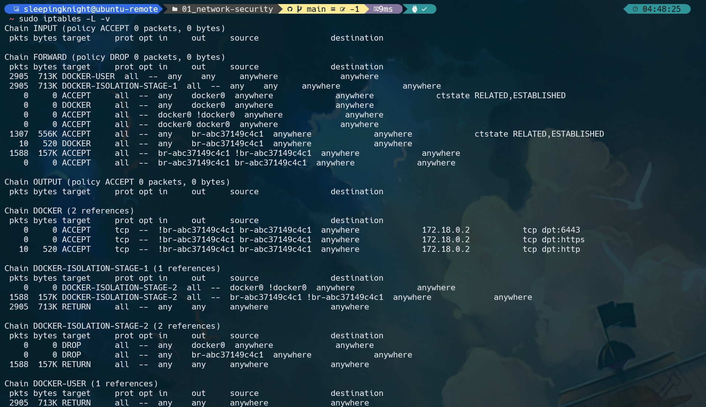

# Check version
```shell
sudo iptables -V
```

# Install if needed
```shell
sudo apt-get update
sudo apt-get install iptables
```

# Show configuration status
```shell
sudo iptables -L -v
```
It will be show like this



# Get default gateway in eth0 (inet)
```shell
ifconfig
ping <default-gateway>
```


# Block access
```shell
sudo iptables -A OUTPUT -p icmp --icmp-type echo-request -j DROP
sudo iptables -A INPUT -p icmp --icmp-type echo-request -j DROP
```

# Reset firewall rule
```shell
sudo iptables -F
```
