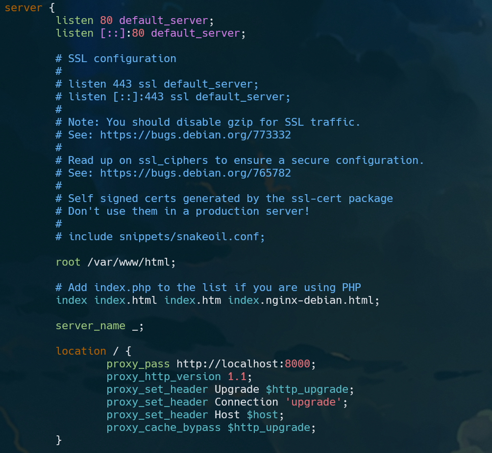

# Step 1: Install Nginx
We can install nginx by running this command (for Ubuntu)
```shell
sudo apt update
sudo apt-get install nginx -y
```

Check nginx status
```shell
sudo systemctl status nginx
sudo systemctl start nginx # if necessary
```

# Step 2: Configure Nginx as Reverse Proxy
By default, nginx configuration file is stored in `/etc/nginx/sites-available/default` </br>

We can edit the file using vi or any text editor </br>
```shell
sudo vi /etc/nginx/sites-available/default
```

Add this code block on the default nginx configuration file
```conf
location / {
    proxy_pass http://localhost:8000;
    proxy_http_version 1.1;
    proxy_set_header Upgrade $http_upgrade;
    proxy_set_header Connection 'upgrade';
    proxy_set_header Host $host;
    proxy_cache_bypass $http_upgrade;
 
    # …
}
```

Remove this code (in `location/` block)
```conf
# First attempt to serve request as file, then
# as directory, then fall back to displaying a 404.
try_files $uri $uri/ =404;
```

It will be show like this 


Restart nginx service
```shell
sudo systemctl restart nginx
```

Don't forget to start our Node.js application sample
```shell
cd a387-jarkom-labs/
npm run start
```

Try to open apps in the browser `<Public-IP>`, we don't need access to application port anymore (port 8000)


# Step 3: Rate Limit in Nginx
Add this block of code in nginx configuration file `/etc/nginx/sites-available/default`
```conf
limit_req_zone $binary_remote_addr zone=one:10m rate=30r/m; # Add

server {
    ...

    location / {
        ...

        limit_req zone=one; # Add
    }

    ...
}
```
Based on the codes, we want to user access resource /(root) only do the request each 2 seconds (rate=30r/m, means that `request per minute` or it equal to `1 request per 2 seconds`)


The configuration should be like this 


Restart nginx service
```shell
sudo systemctl restart nginx
```

* Testing (request more than 1 in 2 seconds)


* Testing (reload again)

