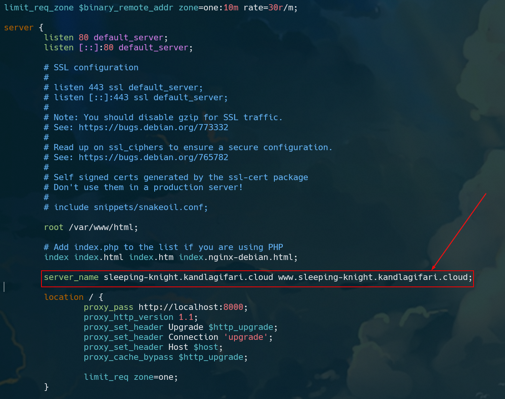

# Step 1: Get Subdomain
Buy our own domain and add new record for our Public IP VM/EC2
```shell
curl -X POST -H "Content-type: application/json" -d "{ \"ip\": \"<public IP EC2 instance>\" }" "https://<sub.custom-domain.cloud>/dns/records"
```

# Step 2: Configure Subdomain for Nginx
Put our two hostname on the `server_name` property inside the `server` block
```conf
server {
    ...

    server_name <sub.custom-domain.cloud> www.<sub.custom-domain.cloud>;

    location / {

    }
}
```

It will be show like this 


Restart nginx service
```shell
sudo systemctl restart nginx
```

Start our Node.js application sample
```shell
cd a387-jarkom-labs/
npm run start
```

Try to open apps in the browser `<sub.custom-domain.cloud>` </br>

We can also use curl utility
```
curl <sub.custom-domain.cloud>
curl sleeping-knight.kandlagifari.cloud
```