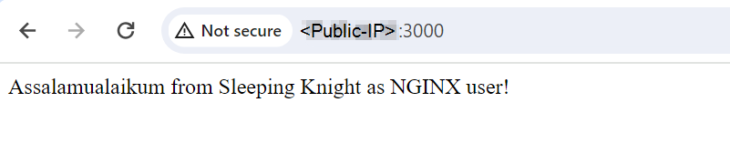
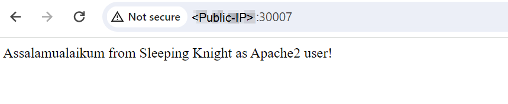

# Part 1: NGINX Configuration
**Step1:** Update and Upgrade System
```shell
sudo apt update 
sudo apt upgrade
```

**Step 2:** Install Nginx
```shell
sudo apt-get install nginx -y
```

**Step 3:** Add this block of code in nginx configuration file `/etc/nginx/sites-available/default`

```conf
limit_req_zone $binary_remote_addr zone=one:10m rate=30r/m; # Add

server {
    ...

    location / {
        proxy_pass http://localhost:8000;
        proxy_http_version 1.1;
        proxy_set_header Upgrade $http_upgrade;
        proxy_set_header Connection 'upgrade';
        proxy_set_header Host $host;
        proxy_cache_bypass $http_upgrade;

        limit_req zone=one; # Add
    }

    ...
}
```

**Step 4:** Start and Enable Nginx
```shell
sudo systemctl enable nginx
sudo systemctl restart nginx
```

**Step 5:** Testing </br>



# Part 2: Apache2 Configuration
**Step1:** Update and Upgrade System
```shell
sudo apt update 
sudo apt upgrade
```

**Step 2:** Install Apache
```shell
sudo apt install apache2 -y
```

**Step 3:** Create a Virtual Host file for your domain. This allows Apache to respond to requests for your domain. Don’t forget to enable the site and optionally disable the default site `/etc/apache2/sites-available/myweb.conf` (default file in `/etc/apache2/sites-available/000-default.conf`)
```conf
# Insert the following configuration:
<VirtualHost *:80>
    ServerName localhost
    ServerAdmin webmaster@localhost
    ProxyPreserveHost On
    ProxyPass / http://localhost:8000/
    ProxyPassReserve / http://localhost:8000/
</VirtualHost>
```

**[Optional] Step 4:** enable site and optionally disable default site
```shell
sudo a2ensite myweb
sudo a2dissite 000-default
```

The command `sudo a2ensite myweb` is used to enable the *myweb* site in Apache. This command creates a symbolic link of the site configuration file from the *sites-available* directory to the *sites-enabled* directory, thereby activating the site configuration. Conversely, the command `sudo a2dissite 000-default` disables the default site provided by Apache. This is achieved by removing the symbolic link for the *000-default* configuration from the *sites-enabled* directory, which stops Apache from loading the default settings.

**Step 5:** Start and Enable Apache
```shell
sudo systemctl enable apache2
sudo systemctl restart apache2
```

**Step 6:** If you get the error `Invalid command 'ProxyPreserveHost', perhaps misspelled or defined by a module not included in the server configuration`

```shell
sudo a2enmod proxy
```


**Step 7:** If you get the error `No protocol handler was valid for the URL /favicon.ico (scheme 'http'). If you are using a DSO version of mod_proxy, make sure the proxy submodules are included in the configuration using LoadModule., referer: http://<Public-IP>:30007/` in apache2 log file on the `/var/log/apache2/error.log`

```shell
sudo a2enmod proxy_http
```

After that, try to restart Apache2 service
```shell
sudo systemctl restart apache2
```

**Step 8:** Testing </br>
