# Part 1: Running Jenkins in Docker
**Step 1:** Create a network bridge in Docker using the following command.
```shell
docker network create jenkins
```
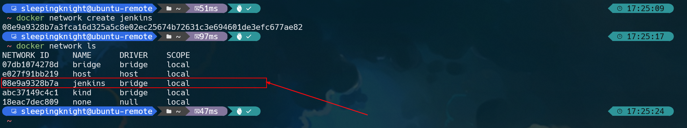

**Step 2:** We will run the React App using a Docker container in a Docker container (more precisely in a Blue Ocean container). This practice is called dind, aka `docker in docker`. So, please download and run `docker:dind` Docker image using the following command.
```shell
docker run \
  --name jenkins-docker \
  --detach \
  --privileged \
  --network jenkins \
  --network-alias docker \
  --env DOCKER_TLS_CERTDIR=/certs \
  --volume jenkins-docker-certs:/certs/client \
  --volume jenkins-data:/var/jenkins_home \
  --publish 2376:2376 \
  --publish 3000:3000 --publish 5000:5000 \
  --restart always \
  docker:dind \
  --storage-driver overlay2
```


The following is an explanation of the command above.

- **--name:** Specifies the name of the Docker container that will be used to run the image.

- **--detach:** Runs the Docker container in the background. However, this instance can be stopped later by running the *docker stop jenkins-docker* command.

- **--privileged:** Running dind (docker in docker aka docker within docker) currently requires *privileged access* to function properly. This requirement may not be necessary with newer Linux kernel versions.

- **--network jenkins:** This corresponds to the network created in the previous step.

- **--network-alias docker:** Makes Docker within a Docker container available as a *docker* hostname within a *jenkins* network.

- **--env DOCKER_TLS_CERTDIR=/certs:** Enables the use of TLS on the Docker server. This is recommended because we are using a *privileged container*. This environment variable controls the root directory where Docker TLS certificates are managed.

- **--volume jenkins-docker-certs:/certs/client:** Maps the /certs/client directory inside the container to a Docker volume named jenkins-docker-certs.

- **--volume jenkins-data:/var/jenkins_home:** Maps the /var/jenkins_home directory inside the container to a Docker volume named jenkins-data. This will allow other Docker containers managed by this Docker container's Docker daemon to mount data from Jenkins.

- **--publish 2376:2376:** Expose the Docker daemon port on the host machine (your computer). This is useful for executing Docker commands on the host machine (your computer) to control the inner Docker daemon.

- **--publish 3000:3000 --publish 5000:5000:** Exposes ports 3000 and 5000 of the dind (docker in docker) container.

- **--restart always:** ensures the container restarts and stays up not only when there is a failure but also after the server in use has also restarted.

- **docker:dind:** This is the image of *docker:dind* itself. This image can be downloaded before running using the *docker image pull docker:dind* command.

- **--storage-driver overlay2:** Storage driver for Docker volumes. See the [Docker Storage drivers](https://docs.docker.com/storage/storagedriver/select-storage-driver) page for supported options.

It also mapping the Docker volume


**Step 3:** Create `Dockerfile` and copy the following contents to your Dockerfile.
```shell
FROM jenkins/jenkins:2.426.2-jdk17
USER root
RUN apt-get update && apt-get install -y lsb-release
RUN curl -fsSLo /usr/share/keyrings/docker-archive-keyring.asc \
  https://download.docker.com/linux/debian/gpg
RUN echo "deb [arch=$(dpkg --print-architecture) \
  signed-by=/usr/share/keyrings/docker-archive-keyring.asc] \
  https://download.docker.com/linux/debian \
  $(lsb_release -cs) stable" > /etc/apt/sources.list.d/docker.list
RUN apt-get update && apt-get install -y docker-ce-cli
USER jenkins
RUN jenkins-plugin-cli --plugins "blueocean:1.27.9 docker-workflow:572.v950f58993843"
```

**Step 4:** Create a new Docker image from the previous Dockerfile and name it `myjenkins-blueocean:2.426.2-1`.
```shell
docker build -t myjenkins-blueocean:2.426.2-1 .
```

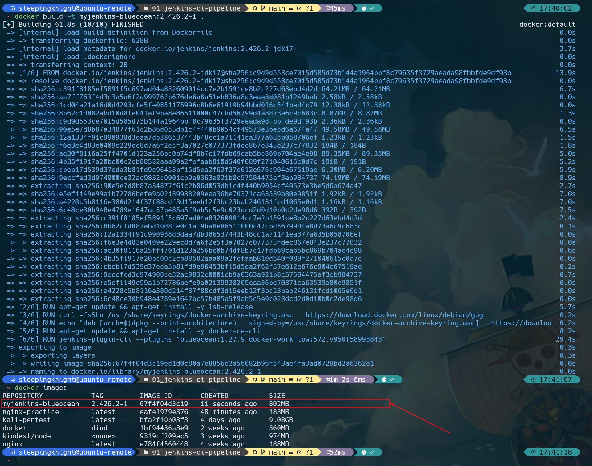

**Step 5:** After that, run `myjenkins-blueocean:2.426.2-1` image as a container in Docker using the following command.
```shell
docker run \
  --name jenkins-blueocean \
  --detach \
  --network jenkins \
  --env DOCKER_HOST=tcp://docker:2376 \
  --env DOCKER_CERT_PATH=/certs/client \
  --env DOCKER_TLS_VERIFY=1 \
  --publish 8080:8080 \
  --publish 50000:50000 \
  --volume jenkins-data:/var/jenkins_home \
  --volume jenkins-docker-certs:/certs/client:ro \
  --volume "$HOME":/home \
  --restart=on-failure \
  --env JAVA_OPTS="-Dhudson.plugins.git.GitSCM.ALLOW_LOCAL_CHECKOUT=true" \
  myjenkins-blueocean:2.426.2-1 
```

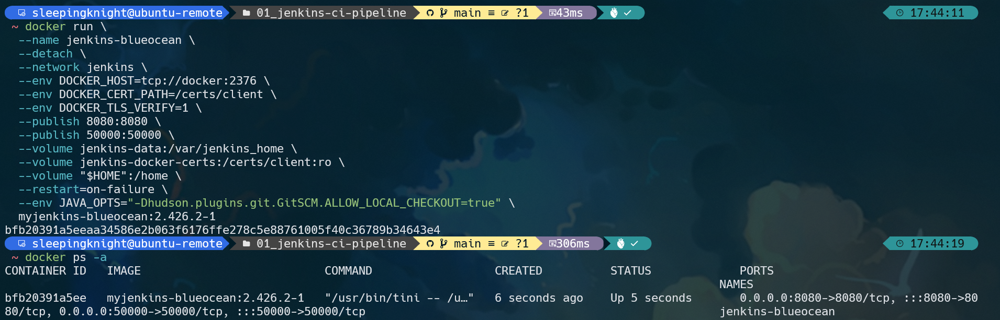

The following is an explanation of the command above.
- **--name:** Specifies the name of the Docker container that will be used to run the image.

- **--detach:** Runs the Docker container in the background.

- **--network jenkins:** Connects this container to the previously created *jenkins* network. This makes the Docker daemon from the previous step available to this container via the *docker* hostname.

- **--env DOCKER_HOST=tcp://docker:2376:** Defines the environment variables used by *docker*, *docker-compose*, and other Docker tools to connect to the Docker daemon from the previous step.

- **--publish 8080:8080:** Map (publish/expose) port 8080 of the current container to port 8080 on the host machine (your computer). The first number represents the port on the host, while the last represents the port on the container. So, if you specify *-p 49000:8080* for this option, you will access Jenkins on the host machine via port 49000.

- **--publish 50000:50000:** Maps (exposes) port 50000 of the current container to port 50000 on the host machine (your computer). This is only necessary if you have set up one or more inbound Jenkins agents on another machine that interacts with your *jenkins-blueocean* container (the Jenkins "controller"). Inbound Jenkins agents communicate with the Jenkins controller via TCP port 50000 by default. You can change this port number on the Jenkins controller via the Configure Global Security page.

- **--volume jenkins-data:/var/jenkins_home:** Maps the container's */var/jenkins_home* directory to a Docker volume named jenkins-data.

- **--volume jenkins-docker-certs:/certs/client:ro:** Maps the container's /certs/client directory to a previously created volume named jenkins-docker-certs. This creates client TLS certificates to connect to the available Docker daemon at the path specified by the DOCKER_CERT_PATH environment variable.

- **--volume "$HOME":/home:** Maps the $HOME directory on the host machine (your computer, usually the */Users/your-username* directory) to the */home* directory on the container.

- **--restart=on-failure:** Configure the Docker container restart policy to restart when a failure occurs.

- **--env JAVA_OPTS="-Dhudson.plugins.git.GitSCM.ALLOW_LOCAL_CHECKOUT=true":** Allows checkout on local repositories.

- **myjenkins-blueocean:2.426.2-1:** The name of the Docker image you created in the previous step.


# Part 2: Setting up Jenkins Wizard
**Step 1:** Open your browser and run http://{{Public-IP}}:8080. Wait until the **Unlock Jenkins** page appears.

**Step 2:** As it says, you are required to copy the password from the Jenkins log to ensure that Jenkins is accessed safely by administrators. 

**Step 3:** Display the Jenkins console log with the following command in Terminal/CMD
```shell
docker logs jenkins-blueocean
```

**Step 4:** From the Terminal/CMD application, copy the password between the 2 series of asterisks.


**Step 5:** Return to the *Unlock Jenkins* page in the browser, paste the password into the **Administrator password** column and click **Continue**.

**Step 6:** After that, the Customize Jenkins page appears. Select **Install suggested plugins**. The setup wizard shows progress that Jenkins is being configured and recommended plugins are being installed. This process may take up to several minutes. <br>
**Note:** If there is a failure during the plugin installation process, you can click **Retry** (to repeat the plugin installation process until it is successful) or click **Continue** (to skip and proceed directly to the next step).

**Step 7:** Once done, Jenkins will ask you to create an administrator user. When the *Create First Admin User* page appears, fill it in according to your wishes and click **Save and Continue**.

**Step 8:** On the Instance Configuration page, select **Save and Finish**. That means, we will access Jenkins from the url http://{{localhost}}:8080/. 

**Step 9:** When the *Jenkins is ready* page appears, click the **Start using Jenkins** button.
Note: This page may indicate *Jenkins is almost ready!* If so, click **Restart**. If the page doesn't refresh automatically after a few minutes, manually click the *refresh* icon in your browser.

**Step 10:** If necessary, you can log back into Jenkins using the credentials you created earlier.


# Part 3: Fork and Clone React App Repository
**Step 1:** Fork the [React App repository](https://github.com/dicodingacademy/a428-cicd-labs/tree/react-app) on Dicoding Academy to your personal GitHub account. When forking, don't forget to uncheck the copy the main branch only option. If you need help with this process, check out the [Fork A Repo](https://help.github.com/articles/fork-a-repo/) documentation on the GitHub website for more information.

**Step 2:** Clone a React App that has been forked to your GitHub account to your local environment. 
```shell
git clone -b react-app https://github.com/YOUR-GITHUB-USERNAME/a428-cicd-labs.git
```

You can also rename the directory, for example
```shell
mv a428-cicd-labs cicd-implementation-labs
```

# Part 4: Creating a Pipeline Project in Jenkins
**Step 1:** Open the Jenkins page. If necessary, go to http://{{localhost}}:8080/ and log in again with your credentials.

**Step 2:** In the *Welcome to Jenkins!* section, click **Create a job**. If you don't see it, click **New Item** at the top left.

**Step 3:** In the *Enter an item name* column, fill in the name of the pipeline you want, for example **react-app**. Then, select **Pipeline** and click **OK**.

**Step 4:** On the next page, enter a short description for your pipeline in the Description column, for example **A simple pipeline for a React App project**.

**Step 5:** After that, open the tab that says **Pipeline** above the *Description* column which will take you to scroll down to the *Pipeline* section.

**Step 6:** In the *Definition* section, select the **Pipeline script from SCM** option. This option instructs Jenkins to create a Pipeline from Source Control Management (SCM), which means the Git repository that you previously cloned to the local environment.

**Step 7:** In the SCM column, select **Git**.

**Step 8:** In the Repository URL section, enter the directory path (directory location) from the local repository for the React App that you previously cloned, namely from the user account or home directory on your host machine (computer) which is mapped to the /home directory on the Jenkins container. For example (adjust to the directory structure on your computer).
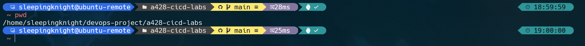

**Note:** You don't need to include the computer's hostname (/home/sleepingknight), but just **/home** and go straight to the destination directory.

Make sure, your **/home/YOUR-USERNAME** directory have given *read* and *execute* permission to other user/group
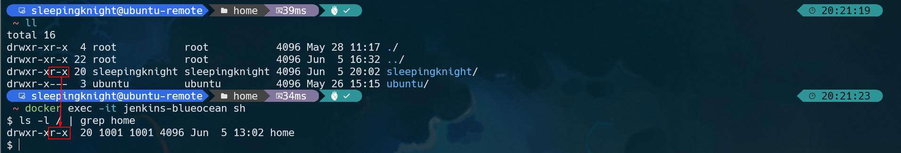

Just in case, you are facing this error
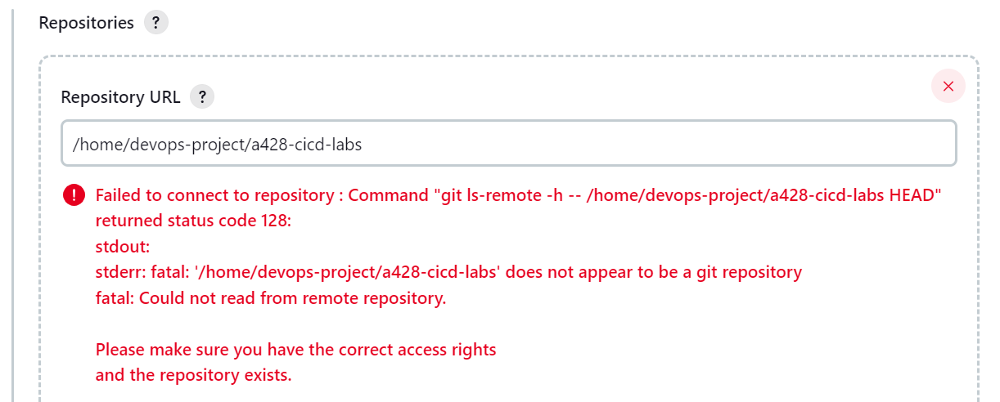

**Step 9:** After that, scroll down. In the *Branch Specifier (blank for 'any')*, change it to `*/react-app`. This means that we want to focus on the branch called **react-app** (as we cloned previously).

**Step 10:** Then, click the **Save** button to save your Pipeline project.


# Part 5: Create a Jenkins Pipeline with Jenkinsfile
**Step 1:** Change to the react application directory **cicd-implementation-labs** in the `react-app branch`, and create a new file called Jenkinsfile
```shell
vi Jenkinsfile
```

**Step 2:** Once the *Jenkinsfile* file is open, copy the Declarative Pipeline code below into the file.
```Jenkinsfile
pipeline {
  agent {
    docker {
      image 'node:16-buster-slim'
      args '-p 3000:3000'
    }
  }
  stages {
    stage('Build') {
      steps {
        sh 'npm install'
      }
    }
    stage('Test') { 
      steps {
        sh './jenkins/scripts/test.sh' 
      }
    }
  }
}
```

The following is an explanation of the script above.
- **image 'node:16-buster-slim':** This image parameter (from the docker parameters agent section) downloads a Docker image named **node:16-buster-slim** (if it is not already available on your computer) and runs the image as a separate container. This means the following. 

  + You will have a separate Jenkins container and Node container running locally in Docker. 

  + The node container is the agent that Jenkins uses to run your Pipeline project. However, this container will only run for the duration of your Pipeline execution.

- **args '-p 3000:3000':** This *args* parameter makes this Node container accessible (temporarily) via port 3000. This is important for running the **jenkins/scripts/deliver.sh** file.

- **stage('Build'):** Defines a *stage* called **Build** that appears in the Jenkins UI.

- **sh 'npm install':** The *sh* step (from the *steps* section) executes *npm* commands to ensure that all dependencies required to run the React App application have been downloaded to the *node_modules* directory.

- **stage('Test'):** Defines a *stage* called **Test** that appears in the Jenkins UI.

- **sh './jenkins/scripts/test.sh':** The *sh* step (from the *steps* section) runs a shell script called *test.sh* located in the *jenkins/scripts* directory of the root of the react-app repository. An explanation of what this script does is included in the *test.sh* file itself. In essence, the file runs the **npm test** command, which will run the **react-scripts test --env=jsdom** syntax written in the **package.json** file. This syntax runs the test as stated in the **src/App.test.js** file, namely testing whether the application can render without crashing.

**Step 3:**  After saving, now commit the file to your local repository by running the following command.
```shell
git add .
git commit -m “Jenkinsfile testing”
```

**Step 4:** Return to the Jenkins page, log in if necessary, and make sure you access the Blue Ocean interface.

**Step 5:** Click the **RUN** button in the top left corner, then immediately click the link that says **OPEN** that appears in the bottom right to see how Jenkins runs your Pipeline project. If you can't open the OPEN link, click the top row of the Blue Ocean interface.

**Step 6:** If the Pipeline runs successfully, this is what the Blue Ocean interface will look like.
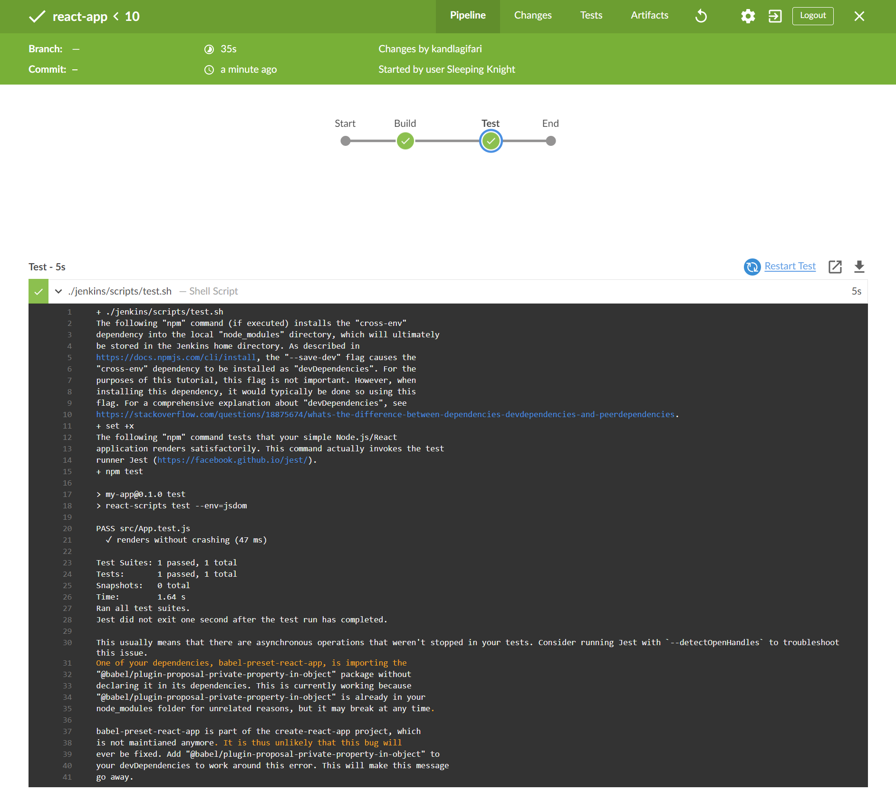


# Part 6: Added Deploy Stage to Jenkinsfile
**Step 1:** Copy the following declarative pipeline syntax just below *Test stage* in your **Jenkinsfile**.
```Jenkinsfile
    stage('Deploy') {
      steps {
        sh './jenkins/scripts/deliver.sh'
        input message: 'Sudah selesai menggunakan React App? (Klik "Proceed" untuk mengakhiri)'
        sh './jenkins/scripts/kill.sh'
      }
    }
```

Now, the entire Jenkinsfile will look like the following.
```Jenkinsfile
pipeline {
  agent {
    docker {
      image 'node:16-buster-slim'
      args '-p 3000:3000'
    }
  }
  stages {
    stage('Build') {
      steps {
        sh 'npm install'
      }
    }
    stage('Test') {
      steps {
        sh './jenkins/scripts/test.sh'
      }
    }
    stage('Deploy') { 
      steps {
        sh './jenkins/scripts/deliver.sh' 
        input message: 'Sudah selesai menggunakan React App? (Klik "Proceed" untuk mengakhiri)' 
        sh './jenkins/scripts/kill.sh' 
      }
    }
  }
}
```
The following is an explanation of the script above.
- **stage('Deploy'):** Defines a new stage called “Deploy” that appears in the Jenkins UI.

- **sh './jenkins/scripts/deliver.sh':** This `sh` step (from the `steps` section) runs a shell script called deliver.sh located in the jenkins/scripts directory of the root of the react-app repository. An explanation of what this script does is included in the *deliver.sh* file itself. In essence, the file executes several commands like the following.

  + **npm run build:** Runs the **react-scripts build** syntax written in the **package.json** file. This syntax runs the build process in preparation for deploying to production. 

  + **npm start:** Runs the **react-scripts start** syntax written in the **package.json** file. This syntax starts the application process so that it can be accessed via *http://localhost:3000* in the browser.

- **input message: 'Are you done using React App? (Click "Proceed" to continue)':** This `input` step (provided by the Pipeline: Input Step plugin) pauses the deployment process so that the React App application can continue to be accessed. In other words, the process for docker:dind (docker in docker, i.e. the container running the React App) can continue to run. How it works, this `input message` asks the user (with a special message) to choose whether they want to "Proceed" (in this case, continue to end the application by running the **kill.sh** script) or "Abort" (in this case, stop the Jenkins Pipeline) .

- **sh './jenkins/scripts/kill.sh':** This sh step runs a shell script called **kill.sh**, which is located in the *jenkins/scripts* directory. An explanation of what this script does is included in the kill.sh file itself. In essence, the file ends the **npm start** process using the PID (process ID).

**Step 2:**  After saving, now commit the file to your local repository by running the following command.
```shell
git add .
git commit -m “Add Deploy stage”
```


# Part 7: Running Jenkins Pipeline
**Step 1:** Open the Jenkins page with the URL *http://localhost:8080/*, log in if necessary, and click **Open Blue Ocean** on the left side to access the Blue Ocean interface in Jenkins.

**Step 2:** Select **react-app**, then click **Run**. Then, immediately click the link that says **OPEN** that appears at the bottom right to see how Jenkins executes your project's Pipeline.

**Step 3:** Pay attention to each stage carried out by Jenkins. You now find there is a new stage called “Deploy”.

**Step 4:** In the Deploy stage, Jenkins executes the **deliver.sh** script as we specified in the Jenkinsfile.

**Step 5:** Then, a prompt appears asking us to choose. This is the result of the *input message* that we defined in the Jenkinsfile.
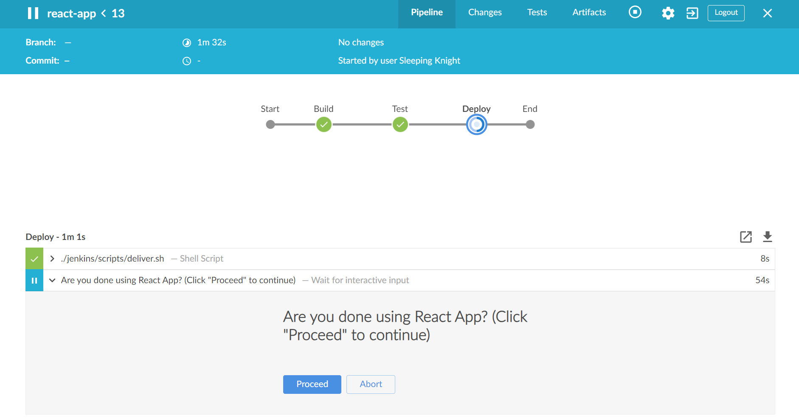

**Step 6:** Before interacting with the prompt, try opening the **./jenkins/scripts/deliver.sh** step to see what happens during the deployment process.

**Step 7:** Scroll down until you find http://localhost:3000 (Use our Public-IP, in case we deployed in VPS/EC2)
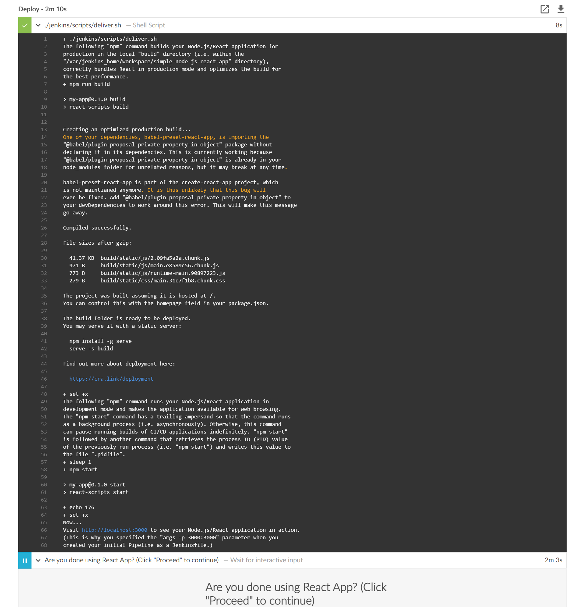

**Step 8:** 
Click on the link. That will open a new tab browser and display the React App application.
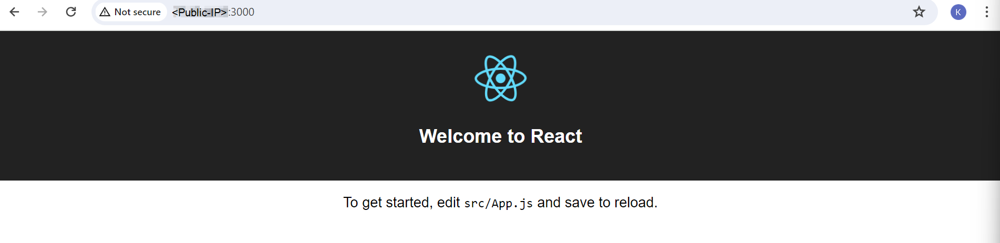


**Step 9:** Yeeaaayy! You have successfully deployed a React App application using Jenkins. Return to the Blue Ocean interface, then select **Proceed** to end the application.

**Step 10:** In Your Code Editor, open the file **cicd-implementation-labs -> src -> App.js**.

**Step 11:** Look for the line of code that contains “Welcome to React”, then change it to “Assalamualaikum from React App”. Don't forget to save the file.
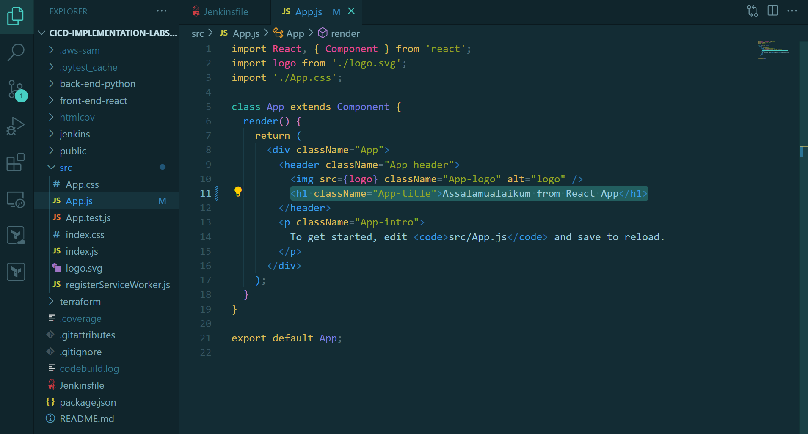

**Step 12:** Commit the changes, then run the Jenkins Pipeline, and open the URL for the React App application again. The display will be as follows.
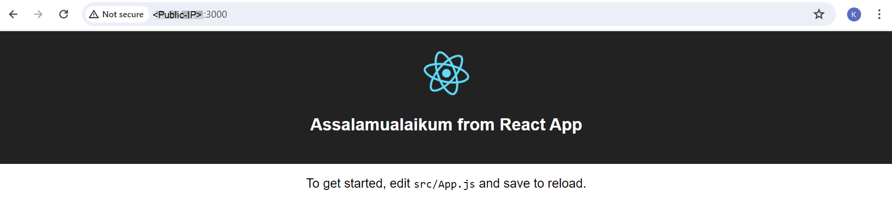

**Step 13:** 
If you are satisfied with exploring the React App, please return to the Jenkins Pipeline page, then click the **Proceed** button to complete the Pipeline execution.
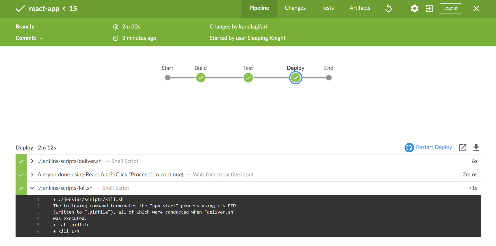

**Step 14:** Click the cross button (X) in the upper right corner to return to the Blue Ocean interface homepage.
