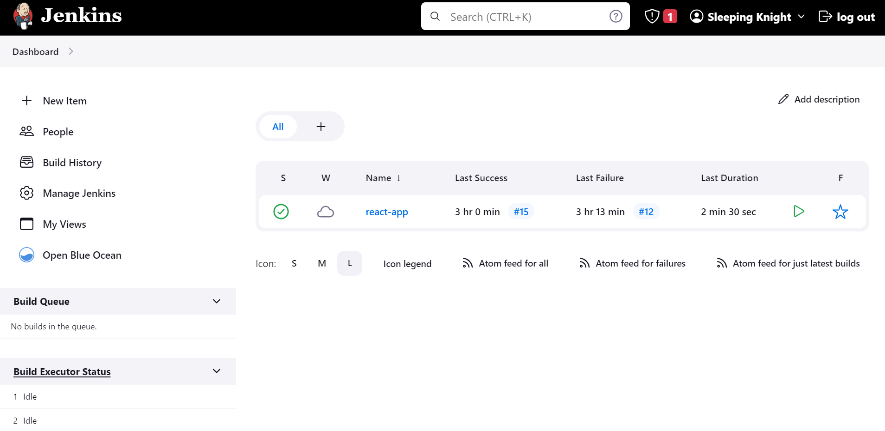
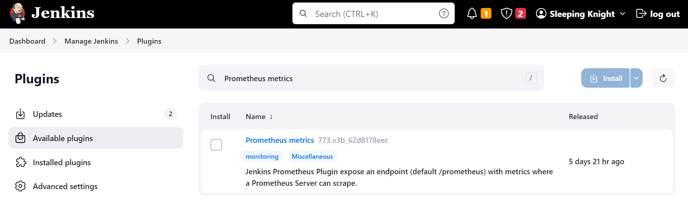
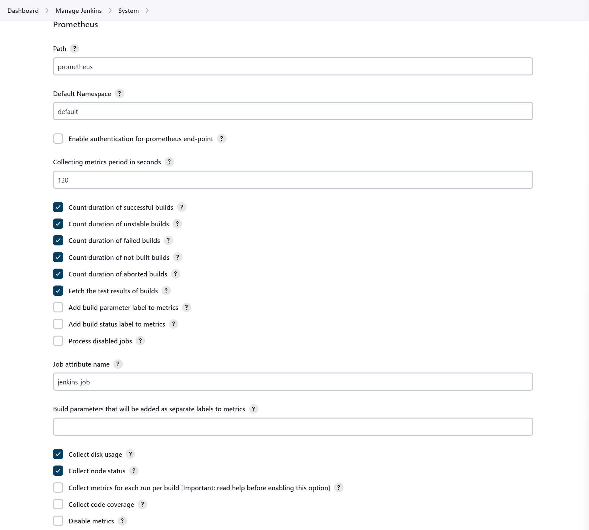
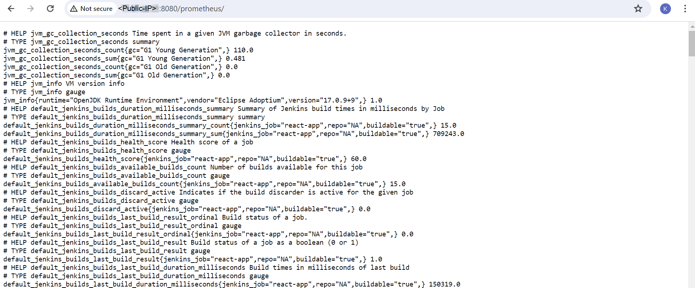

# Part 1: Installing Prometheus Plugin on Jenkins

**Step 1:** Open the **Jenkins** page via your web browser (e.g., http://localhost:8080/) and log in if necessary.

**Note:** If it doesn't open, it's possible that the Jenkins container isn't running. You can run it with the command *“docker start <container_name>”* or via Docker Desktop.

**Step 2:** Arriving at the *Jenkins dashboard*, open the **Manage Jenkins** menu, click **Manage Plugins**.

**Step 3:** On the *Plugin Manager* page, go to the **Available** tab and search for “Prometheus metrics”.

**Step 4:** Check **Prometheus metrics** and click the **Download now and install after restart** button. Wait until the installation process is complete.

**Step 5:** After the text *“Downloaded Successfully. Will be activated during the next boot”*, check the checkbox that says **Restart Jenkins when installation is complete and no jobs are running**. Then, it will restart the Jenkins server.

**Step 6:** Login with Jenkins credentials and navigate to **Manage Jenkins -> Configure System** page. 

**Step 7:** Scroll down to the *Prometheus* section. Remember again that Prometheus works by scraping/retrieving data from the endpoints that we specify. Well, in this case, by default Prometheus will retrieve Jenkins metrics from the **/prometheus** endpoint. You can change it by changing the **Path** section. However, for now let's leave it as is.

**Step 8:** Now, pay attention to the *Collecting metrics period in seconds* section. This describes how often the metrics will be exposed in a matter of seconds. The default is 120 seconds, but let's change it to 5 seconds to make metrics collection faster. Please change the value to **5**.

**Step 9:** Pay attention to several checkboxes below such as Count duration of successful builds, Count duration of unstable builds, and others. They are some metrics that will also be exposed by the Jenkins server.

**Step 10:** After that, please save by clicking the **Save** button. In order for the changes just made to be implemented effectively, we need to restart Jenkins. Please add the **/restart** suffix to the Jenkins URL (for example, http://localhost:8080/restart) and press **Enter**. Then, click **Yes**.

**Step 11:** Jenkins will restart automatically. Please log in again until you return to the Jenkins dashboard.

**Step 12:** Now, try adding the **/prometheus** suffix to the Jenkins URL, for example http://localhost:8080/prometheus. You will see a large row of metrics. Note, when you open `/prometheus`, it will redirect you to `/prometheus/`. This is important when we configure Prometheus later.

**Step 13:** Later, Prometheus will retrieve Jenkins metrics data from this endpoint. And then, because we have changed the metrics collection period to 5 seconds, the Jenkins server will expose metrics to this endpoint every 5 seconds. Please refresh periodically, you will see that some data will change.

**Step 14:** To return to the Jenkins dashboard, delete the **/prometheus/** ending in the address bar again and press Enter.

