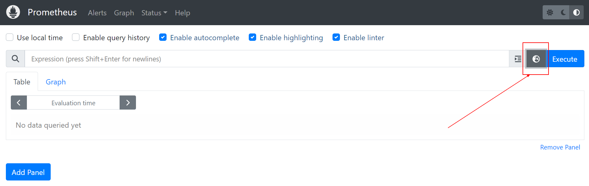

# Part 1: Installing Prometheus Plugin on Jenkins

**Step 1:** Open the **Jenkins** page via your web browser (e.g., http://localhost:8080/) and log in if necessary.


**Note:** If it doesn't open, it's possible that the Jenkins container isn't running. You can run it with the command *“docker start <container_name>”* or via Docker Desktop.

**Step 2:** Arriving at the *Jenkins dashboard*, open the **Manage Jenkins** menu, click **Manage Plugins**.

**Step 3:** On the *Plugin Manager* page, go to the **Available** tab and search for “Prometheus metrics”.


**Step 4:** Check **Prometheus metrics** and click the **Download now and install after restart** button. Wait until the installation process is complete.

**Step 5:** After the text *“Downloaded Successfully. Will be activated during the next boot”*, check the checkbox that says **Restart Jenkins when installation is complete and no jobs are running**. Then, it will restart the Jenkins server.

**Step 6:** Login with Jenkins credentials and navigate to **Manage Jenkins -> Configure System** page. 

**Step 7:** Scroll down to the *Prometheus* section. Remember again that Prometheus works by scraping/retrieving data from the endpoints that we specify. Well, in this case, by default Prometheus will retrieve Jenkins metrics from the **/prometheus** endpoint. You can change it by changing the **Path** section. However, for now let's leave it as is.


**Step 8:** Now, pay attention to the *Collecting metrics period in seconds* section. This describes how often the metrics will be exposed in a matter of seconds. The default is 120 seconds, but let's change it to 5 seconds to make metrics collection faster. Please change the value to **5**.

**Step 9:** Pay attention to several checkboxes below such as Count duration of successful builds, Count duration of unstable builds, and others. They are some metrics that will also be exposed by the Jenkins server.

**Step 10:** After that, please save by clicking the **Save** button. In order for the changes just made to be implemented effectively, we need to restart Jenkins. Please add the **/restart** suffix to the Jenkins URL (for example, http://localhost:8080/restart) and press **Enter**. Then, click **Yes**.

**Step 11:** Jenkins will restart automatically. Please log in again until you return to the Jenkins dashboard.

**Step 12:** Now, try adding the **/prometheus** suffix to the Jenkins URL, for example http://localhost:8080/prometheus. You will see a large row of metrics. Note, when you open `/prometheus`, it will redirect you to `/prometheus/`. This is important when we configure Prometheus later.


**Step 13:** Later, Prometheus will retrieve Jenkins metrics data from this endpoint. And then, because we have changed the metrics collection period to 5 seconds, the Jenkins server will expose metrics to this endpoint every 5 seconds. Please refresh periodically, you will see that some data will change.

**Step 14:** To return to the Jenkins dashboard, delete the **/prometheus/** ending in the address bar again and press Enter.


# Part 2: Configuring Prometheus

Even though the Prometheus plugin is installed, the metrics endpoint is ready, and the URL is accessible; That doesn't necessarily mean that Prometheus can be directly used to monitor Jenkins. 

Recall that by default Prometheus only exports metrics about itself. In order to monitor the system outside itself, we must use the Prometheus exporter or client libraries. However, we can skip this because we have used the Prometheus metrics plugin in Jenkins. This plugin works by exposing metrics to an endpoint (namely /prometheus by default) when the Prometheus server can later retrieve data from that endpoint.


**Step 1:** First, let's check the metrics registered with Prometheus. Please open **http://localhost:9090/** in a web browser to open the Prometheus page.

**Step 2:** Once open, click the **Open metrics explorer** icon right next to the Execute button.


**Step 3:** Then, the Metrics Explorer will appear which contains various metrics, most of which are still related to Prometheus metrics.


**Step 4:** Check the initial target endpoint by opening the **Status -> Targets** menu.


We can see that there is only 1 Prometheus target


**Step 5:** OK, it's confirmed that Prometheus still doesn't have Jenkins metrics. For that, we will configure it by going to the Prometheus container. You can use Terminal or CMD to run the following command to enter the Prometheus container.
```shell
docker exec -it prometheus sh
```


**Note:** If that doesn't work, try replacing *sh* with *bash*.

**Step 6:** After entering the container, open the **prometheus.yml** file with the **vi** editor tools.
```shell
vi /etc/prometheus/prometheus.yml
```

**Step 7:** To be able to edit, press **Insert** on the keyboard. In the last line, add the following code to define the job name (task name), metrics path (Jenkins metrics location endpoint), and targets (Jenkins URL).
```yaml
  - job_name: "jenkins"                                                        
    metrics_path: /prometheus/                                                
    static_configs:                                                            
       - targets: ["172.19.0.1:8080"] # Adjust with your IP Gateway Network Jenkins 
```
Thus, the **scrape_configs** section of the file as a whole looks like this.
scrape_configs:
```yaml
  # The job name is added as a label `job=<job_name>` to any timeseries scraped
  - job_name: "prometheus"                                                      
                                                                               
    # metrics_path defaults to '/metrics'                                      
    # scheme defaults to 'http'.                                              
                                                                               
    static_configs:                                                            
      - targets: ["localhost:9090"]                                            
                                                                               
  - job_name: "jenkins"                                                        
    metrics_path: /prometheus/                                                
    static_configs:                                                            
      - targets: ["172.19.0.1:8080"] # Adjust with your IP Gateway Network Jenkins 
```

**Note:** Because Jenkins and Prometheus run in different containers, we cannot use the URL *localhost:8080*. From Prometheus perspective, the way to access Jenkins is with *172.19.0.1* (IP Gateway Network Jenkins). You can get IP Gateway Network Jenkins by running this command on host machine

```shell
docker network inspect jenkins
``` 


**References:** In case [error](https://stackoverflow.com/questions/54397463/getting-error-get-http-localhost9443-metrics-dial-tcp-127-0-0-19443-conne) on the Prometheus Targets

**Step 8:** OK, please save the file by pressing **Esc** on the keyboard, then type **:wq**, and press **Enter**. In the terminal, type **exit** to terminate the container session.

**Step 9:** After that, please restart the Prometheus container so that it applies the latest configuration. You can run the following command in Terminal or CMD.
```shell
docker restart prometheus
```

**Step 10:** Access the Prometheus page again with the URL **http://localhost:9090/**. Open the **Status menu -> Targets**.

**Step 11:** Note that the target endpoint for Jenkins is UP.


**Step 12:** Return to the main page by clicking the **Prometheus** logo in the top left corner. Once open, click the **Open metrics explorer** icon right next to the *Execute* button.

**Step 13:** Then, the Metrics Explorer will appear which contains various metrics. Pay attention, now it also contains various metrics from Jenkins, such as *default_jenkins_builds_health_score, default_jenkins_builds_last_build_duration_milliseconds, default_jenkins_builds_last_build_result,* and various others.


**Step 14:** Let's try one of the metrics. First of all, try running **Jenkins Pipeline** for react-app. Go to the Jenkins dashboard page, click **Open Blue Ocean**, select **react-app**, and click **Run**. 

**Step 15:** Click the **top** row and wait for the pipeline execution process to take place. When the option appears, click **Proceed** to end the application. OK, up to this point it means that the react-app was successfully executed by the Jenkins Pipeline. Pay attention to the top of the page which states that the pipeline execution process lasts **38s**, aka 30 seconds (can vary).


**Step 16:** Return to the **Prometheus** page, click the **Open metrics explorer** icon, and select *default_jenkins_builds_last_build_duration_milliseconds* to find out the duration of the last build in Jenkins in milliseconds. Then, click the **Execute** button.

**Step 17:** Query results will appear at the bottom. It can be seen that the last build process was in the react-app pipeline with a duration of 37506 milliseconds. When converted, this is equivalent to 38 seconds. In accordance!


# Part 3: Creating a Dashboard in Grafana
After completing various previous stages, now Jenkins can expose metrics and Prometheus can take them for processing. So, what's next? Of course, it is a visualization of metrics so that we can monitor them easily.

In fact, in Prometheus itself we can visualize data metrics. Want to try it? Reopen the Prometheus page that displays the results of the last build duration query. Instead of selecting Table, try opening the **Graph** tab. You will see the query results in graphic form, which can be an unstacked line graph or a stacked graph.


However, Prometheus' capabilities for visualization of data metrics are very limited. There are not many options that we can choose to help with monitoring. Therefore, we will use Grafana, which can visualize metrics data completely and attractively.

**Step 1:** Make sure the Grafana container is still running. in Terminal, you can run the **docker ps** command and the Grafana container should display the status **Up**.


**Step 2:** Next, open the Grafana page by visiting **http://localhost:3030/** in a web browser. The Grafana login display will immediately appear.


**Step 3:** Please fill in the following values.
  + **Email or username:** admin
  + **Password:** admin

**Step 4:** On the next page, you are asked to enter a new password. Please fill in according to your wishes or skip it by clicking **Skip**.

**Step 5:** Then, you will be directed to the Home page of Grafana.


**Step 6:** The first thing we need to do to create a dashboard in Grafana is add a *data source* first. From the Home page, click **Add your first data source**.

**Step 7:** After that, select **Prometheus**. Adjust to the following configuration.
  + **Name:** Prometheus - Jenkins
  + **URL:** http://{{your-prometheus-network-gateway}}:9090

Again, because Prometheus and Grafana run in different containers, we cannot use a URL for Prometheus like localhost:9090. From Grafana's perspective, the way to access Prometheus is with *172.17.0.1* (IP Gateway Network Prometheus).


**Step 8:** If everything is correct, scroll down and click **Save & test**. Make sure it says **Data source is working**.


**Step 9:** That means now we are ready to create a dashboard. Go to the Home page by clicking the **Grafana** logo in the top left corner. Click **Create your first dashboard**, then select Add a new panel. 


**Step 10:** Then the Edit Panel page will open. Be creative in creating the dashboard you want.

**Step 11:** We'll try to guide you, OK? First, adjust the *visualization* options located at the top right. Change from the original *Time series* to **Stat**. 

**Step 12:** Next, please adjust it to the following configuration.
  1. **Title:** Last Build Duration
  2. **Metric:** default_jenkins_builds_last_build_duration_milliseconds

**Step 13:** Then, click the **Run queries** button. Ta-da! This is what it looks like.


**Step 14:** Save the panel by clicking the **Save** button. Enter **Jenkins Dashboard** in the *Dashboard name*, then click **Save**.

**Step 15:** Now you have a dashboard that only contains 1 panel. That means, your dashboard only displays a small part of the information related to Jenkins.


**Step 16:** You can add as many panels as you like by clicking the **Add** at the top of the page.


**Step 17:** If you feel that adding panels one by one is a tiring activity, you can import the dashboard available on the official Grafana website.

**Step 18:** Please visit [Grafana dashboard](https://grafana.com/grafana/dashboards/). In the search box, enter **Jenkins**. Filter by selecting **Prometheus** in *Data Source*. 

**Step 19:** Select **Jenkins: Performance and Health Overview**. Click the **Copy ID to Clipboard** button. This will copy the ID of that dashboard to your clipboard.

**Step 20:** Return to the Jenkins Dashboard page that you previously created in Grafana. Hover your mouse over the *Dashboards* icon on the left, then select **Import** (click **Save dashboard -> Save** if you have made changes).


**Step 21:** Paste (CTRL+V) the dashboard ID that was copied earlier in the **Import via grafana.com** column and click **Load** next to it.


**Step 22:** The next page will contain all information related to the dashboard you want to import, such as who published it, when it was last updated, and so on. Continue by selecting **Prometheus - Jenkins** for the *Prometheus* section and click the **Import** button.


**Step 23:** *Voila!* Various needs regarding Jenkins are automatically available. Cool, right?


Don't forget to save the dashboard by clicking the **Save dashboard** button **-> Save**.

*Yeaah!* You have successfully configured Prometheus and Grafana to monitor Jenkins. What an achievement! Now, you can monitor how the Jenkins server works, such as CPU usage, memory consumption, job duration (pipeline execution process), number of failed jobs, and so on.

You can see these metrics for a certain period, for example the last 30 minutes, last 3 hours, last week, or even last month.


To be more helpful in monitoring, you can also determine how often Grafana should refresh the dashboard automatically, whether every 5 seconds, every 5 minutes, once an hour, or maybe manually.

Because, previously we set the Jenkins server to expose its metrics every 5 seconds, the best practice is to also set Grafana to refresh the dashboard every 5 seconds.


