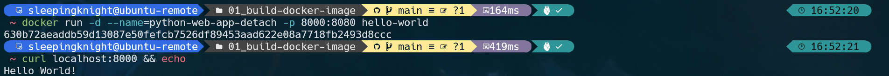
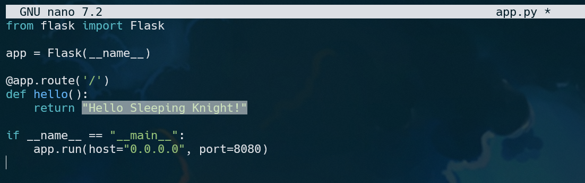
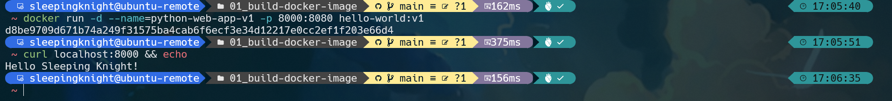
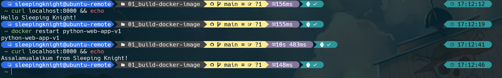

# Part 1: Creating a Docker Image from a Dockerfile

**Step 1:** This exercise will use the Python programming language to create a simple web application that displays the text “Hello World” in a web browser. So, create three new files named **Dockerfile**, **app.py** and **requirements.txt**
```shell
touch Dockerfile app.py requirements.txt
```

**Step 2:** Make sure you currently have the **requirements.txt** file open. If not, click on the requirements.txt file in the left Explorer pane. Then, fill in the following lines of code.
```txt
flask
```
If you are not familiar, Flask is a web framework written in the Python programming language that provides libraries for building web applications.

**Step 3:** Next, open the **app.py** file (via the Explorer panel or tab at the top) and copy the line of code below.
```python
from flask import Flask

app = Flask(__name__)

@app.route('/')
def hello():
    return "Hello World!"

if __name__ == "__main__":
    app.run(host="0.0.0.0", port=8080)
```

Simply put, when we open a URL such as http://127.0.0.1:8080/, http://localhost:8080/, or http://0.0.0.0:8080/ in a web browser on the local computer, our application will display text "Hello World!".

**Step 4:** After that, open the **Dockerfile** file and copy the code below.
```Dockerfile
FROM python:3.8

WORKDIR /app

COPY . .

RUN pip install -r requirements.txt

EXPOSE 8080

CMD [ "python", "app.py" ]
```

The following is an explanation of each line of instructions/commands from the code above.
- **FROM python:3.8 :** Docker will download/fetch a base image named python from Docker Hub with the tag **3.8** (indicating the python version 3.8). If it has been downloaded before, Docker will fetch it from local. Please note, this base image **python:3.8** already contains most of the tools and libraries needed to run a python application. So, with this base image, we can directly run Python commands in the container.
- **WORKDIR /app :** We create a new directory called app (as if running the **mkdir app** command manually) inside the container and make it the working directory (as if running the cd app/ command manually). That way, whatever instructions we write in the next line, will be executed in this /app directory.
- **COPY . . :** The first dot indicates the source (that is, the working directory on the local computer), while the second dot shows the destination (that is, the working directory on the container). That means, we copy all the files in the current local working directory (for example, **//home/sleepingknight/01_build-docker-image** which contains app.py, Dockerfile, and requirements.txt) to the container working directory (that is, **/app**).
- **RUN pip install -r requirements.txt :** RUN is used to run commands during the image creation process. In this case, we run the **pip install -r requirements.txt** command when creating the image to install the web application dependency (requirements), namely flask (as written in the requirements.txt file).
- **EXPOSE 8080 :** This instruction is used to expose or open a port on the container. Because in the app.py file we specify that the application runs on port 8080, here we also expose the port that will be used by the container, namely 8080. 
- **CMD [ "python", "app.py" ] :** While the RUN instruction is used to execute commands during the image creation process, the CMD (command) instruction is used to execute commands when the Docker image has been run as a container. In this case, we execute the command to run the web application, namely **[ "python", "app.py" ]** which means **python app.py** when in the shell.

**Step 5:** OK, everything is ready. Let's run the docker build command to start building the Docker image from the Dockerfile.
```shell
docker build -t hello-world .


# [+] Building 34.9s (9/9) FINISHED                                                                                               docker:default
#  => [internal] load build definition from Dockerfile                                                                                      0.0s
#  => => transferring dockerfile: 155B                                                                                                      0.0s
#  => [internal] load metadata for docker.io/library/python:3.8                                                                             2.5s
#  => [internal] load .dockerignore                                                                                                         0.0s
#  => => transferring context: 2B                                                                                                           0.0s
#  => [1/4] FROM docker.io/library/python:3.8@sha256:01a4da15f16395a2d17dd9b673ccedcd6a6dbb4e130c8056d0d804dedac11c81                      28.9s
#  => => resolve docker.io/library/python:3.8@sha256:01a4da15f16395a2d17dd9b673ccedcd6a6dbb4e130c8056d0d804dedac11c81                       0.0s
#  => => sha256:01a4da15f16395a2d17dd9b673ccedcd6a6dbb4e130c8056d0d804dedac11c81 1.86kB / 1.86kB                                            0.0s
#  => => sha256:c6cf28de8a067787ee0d08f8b01d7f1566a508b56f6e549687b41dfd375f12c7 49.58MB / 49.58MB                                          4.3s
#  => => sha256:6582c62583ef22717db8d306b1d6a0c288089ff607d9c0d2d81c4f8973cbfee3 64.14MB / 64.14MB                                          4.1s
#  => => sha256:340112dda59ac649527c9a8ba86f02343d981cb508161ba34ae7bb52a797e6ce 2.01kB / 2.01kB                                            0.0s
#  => => sha256:fc6a57648aa5e9aef11fe915791e34dfce19169a2a77a312b0bd3ab40e264d7c 7.36kB / 7.36kB                                            0.0s
#  => => sha256:891494355808bdd3db5552f0d3723fd0fa826675f774853796fafa221d850d42 24.05MB / 24.05MB                                          4.1s
#  => => sha256:bf2c3e352f3d2eed4eda4feeed44a1022a881058df20ac0584db70c138b041e2 211.21MB / 211.21MB                                       11.7s
#  => => sha256:a99509a323905a80628005e4f3bc26ac15ebaf3ffdb08a9646a7f2d110ab38f9 6.39MB / 6.39MB                                            5.1s
#  => => extracting sha256:c6cf28de8a067787ee0d08f8b01d7f1566a508b56f6e549687b41dfd375f12c7                                                 4.2s
#  => => sha256:7327cba2bf36683c119324ade7c9ed62f8a95523d745bb55658ee7f0554a3dd0 15.20MB / 15.20MB                                          6.4s
#  => => sha256:c44e905d3c51b51708b9fde83dce11f6c5b23aae56d591228cab6babac67d71f 244B / 244B                                                5.4s
#  => => sha256:e64bc13ba68336ce21a4ee8553c9e633c496c72408af8b4d5c45e949725b0894 2.85MB / 2.85MB                                            6.1s
#  => => extracting sha256:891494355808bdd3db5552f0d3723fd0fa826675f774853796fafa221d850d42                                                 1.0s
#  => => extracting sha256:6582c62583ef22717db8d306b1d6a0c288089ff607d9c0d2d81c4f8973cbfee3                                                 4.3s
#  => => extracting sha256:bf2c3e352f3d2eed4eda4feeed44a1022a881058df20ac0584db70c138b041e2                                                12.1s
#  => => extracting sha256:a99509a323905a80628005e4f3bc26ac15ebaf3ffdb08a9646a7f2d110ab38f9                                                 0.6s
#  => => extracting sha256:7327cba2bf36683c119324ade7c9ed62f8a95523d745bb55658ee7f0554a3dd0                                                 1.1s
#  => => extracting sha256:c44e905d3c51b51708b9fde83dce11f6c5b23aae56d591228cab6babac67d71f                                                 0.0s
#  => => extracting sha256:e64bc13ba68336ce21a4ee8553c9e633c496c72408af8b4d5c45e949725b0894                                                 0.4s
#  => [internal] load build context                                                                                                         0.0s
#  => => transferring context: 9.88kB                                                                                                       0.0s
#  => [2/4] WORKDIR /app                                                                                                                    0.7s
#  => [3/4] COPY . .                                                                                                                        0.0s
#  => [4/4] RUN pip install -r requirements.txt                                                                                             2.7s
#  => exporting to image                                                                                                                    0.1s
#  => => exporting layers                                                                                                                   0.1s
#  => => writing image sha256:489277ef8eeed6a928af95c2326eaf1dc708f27bd21670b3086d95ca3ff698c4                                              0.0s
#  => => naming to docker.io/library/hello-world                                                                                            0.0s
```

The -t (or --tag) option in the command above is used to provide a name and tag (optional) to the image. Meanwhile, the dot at the end is used to tell Docker to use the Dockerfile file in the current local working directory.

**Step 6:** After the *build* process is complete, run this command to see the list of Docker images available locally.
```shell
docker images


# REPOSITORY            TAG         IMAGE ID       CREATED          SIZE
# hello-world           latest      489277ef8eee   38 seconds ago   1.01GB
```

It can be seen that the Docker image (in other words, repository) named **hello-world** is already available with the tag **latest** (we did not specify a specific tag so Docker will provide a tag named latest by default).

**Step 7:** That means, now we can run containers from that image. Please execute the following command.
```shell
docker run --name=python-web-app -p 8000:8080 hello-world


#  * Serving Flask app 'app'
#  * Debug mode: off
# WARNING: This is a development server. Do not use it in a production deployment. Use a production WSGI server instead.
#  * Running on all addresses (0.0.0.0)
#  * Running on http://127.0.0.1:8080
#  * Running on http://172.17.0.4:8080
# Press CTRL+C to quit
```

**Step 8:** In the command above, we run a container with the name **python-web-app** from an image called **hello-world**. Because we didn't specify a tag name, Docker automatically uses the **latest** tag.

**Step 9:** Also, pay attention to the **-p 8000:8080** section. It is an option used for port mapping between host and container (host:container). That part means that we want to map port 8080 on the container (-p 8000:**8080**) to port 8000 on the host (-p **8000**:8080). With port mapping like this, we can access web applications contained in containers in the host environment. Please open localhost:8000 in your computer's web browser or simply run curl command
```shell
curl localhost:8000


# Hello World!
```

**Step 10:** Pay attention to the Terminal section in Visual Studio Code. If you reload/refresh page **localhost:8000** in the browser several times, the terminal will print information as follows.
```shell
# 172.17.0.1 - - [12/Jun/2024 09:48:04] "GET / HTTP/1.1" 200 -
# 172.17.0.1 - - [12/Jun/2024 09:48:10] "GET / HTTP/1.1" 200 -
# 172.17.0.1 - - [12/Jun/2024 09:48:16] "GET / HTTP/1.1" 200 -
# 172.17.0.1 - - [12/Jun/2024 09:48:22] "GET / HTTP/1.1" 200 -
```

That means, every *request* (in this case access to **localhost:8000**) is successfully handled by our web application. That's a good thing because we can monitor every request that comes into the application. However, this makes our terminal access blocked. While the web application is running, we cannot do anything in the terminal. In fact, maybe we want to check the status of another container, check the image locally, or run a new container. So, what's the solution?

**Step 11:** The solution, we can add the **-d** option (*detach* a.k.a running in the background) when running the container. Let's execute. First, press **CTRL+C** first to stop the **python-web-app** container (as well as the application), then run the following command.
```shell
docker run -d --name=python-web-app-detach -p 8000:8080 hello-world

# 630b72aeaddb59d13087e50fefcb7526df89453aad622e08a7718fb2493d8ccc
```



# Part 2: Create a Docker image from a Container

**Step 1:** Remember that we have stopped the **python-web-app** container with CTRL+C so only **python-web-app-detach** is running at this point. Let's stop *python-web-app-detach* and run python-web-app.
```shell
docker stop python-web-app-detach && docker start python-web-app


# python-web-app-detach
# python-web-app
```

**Step 2:** Check again whether this time the **python-web-app** container is running normally.
```shell
docker ps


# CONTAINER ID   IMAGE                           COMMAND                  CREATED          STATUS              PORTS                                                                                                                                       NAMES
# 5ae17ed8de2d   hello-world                     "python app.py"          10 minutes ago   Up About a minute   0.0.0.0:8000->8080/tcp, :::8000->8080/tcp                                                                                                   python-web-app
```

**Step 3:** Safe! Now, let's access/login to the **python-web-app** container to execute some things.
```shell
docker exec -it python-web-app /bin/bash


# root@5ae17ed8de2d:/app#
```

**Step 4:** Check what files are in the **/app** directory.
```shell
ls


# root@5ae17ed8de2d:/app# ls
# Dockerfile  README.md  app.py  pics  requirements.txt
```
Cool! This is as per our instructions in the Dockerfile.

**Step 5:** Next, we make changes to the **app.py** file. However, because the text editor that we will use is not yet available in the container, we will first install it directly in the container.
```shell
apt-get update && apt-get install nano


# root@5ae17ed8de2d:/app# apt-get update && apt-get install nano
# Get:1 http://deb.debian.org/debian bookworm InRelease [151 kB]
# Get:2 http://deb.debian.org/debian bookworm-updates InRelease [55.4 kB]
# Get:3 http://deb.debian.org/debian-security bookworm-security InRelease [47.9 kB]
# Get:4 http://deb.debian.org/debian bookworm/main amd64 Packages [8786 kB]
# Get:5 http://deb.debian.org/debian bookworm-updates/main amd64 Packages [13.8 kB]
# Get:6 http://deb.debian.org/debian-security bookworm-security/main amd64 Packages [160 kB]
# Fetched 9214 kB in 3s (3653 kB/s)
# Reading package lists... Done
# Reading package lists... Done
# Building dependency tree... Done
# Reading state information... Done
# Suggested packages:
#   hunspell
# The following NEW packages will be installed:
#   nano
# 0 upgraded, 1 newly installed, 0 to remove and 0 not upgraded.
# Need to get 689 kB of archives.
# After this operation, 2871 kB of additional disk space will be used.
# Get:1 http://deb.debian.org/debian bookworm/main amd64 nano amd64 7.2-1 [689 kB]
# Fetched 689 kB in 0s (20.6 MB/s)
# debconf: delaying package configuration, since apt-utils is not installed
# Selecting previously unselected package nano.
# (Reading database ... 23963 files and directories currently installed.)
# Preparing to unpack .../archives/nano_7.2-1_amd64.deb ...
# Unpacking nano (7.2-1) ...
# Setting up nano (7.2-1) ...
# update-alternatives: using /bin/nano to provide /usr/bin/editor (editor) in auto mode
# update-alternatives: using /bin/nano to provide /usr/bin/pico (pico) in auto mode
```

**Step 6:** After that, open the **app.py** file.
```shell
nano app.py
```

**Step 7:** Change the “Hello World!” to “Hello Sleeping Knight!” like this.



**Step 8:** Save changes by pressing CTRL+X, then Y, and finally Enter.

**Step 9:** Exit the container by typing exit.

You will be returned to the host's bash prompt. This exit command will only log you out of the container terminal, not stop the container. So, the container will continue to run.

**Step 10:** OK, now let's create a Docker image of the running container using the *docker commit* command like this.
```shell
docker commit python-web-app hello-world:v1


# sha256:5b1c63cfdfa4e3b51e3ece75931624a14f7c0246332b6cac19a4f002f4e9d981
```

Notice that we now define a specific tag, namely v1.

**Step 11:** Check, you should now have two Docker images.
```shell
docker images


# REPOSITORY            TAG         IMAGE ID       CREATED          SIZE
# hello-world           v1          5b1c63cfdfa4   16 seconds ago   1.03GB
# hello-world           latest      489277ef8eee   20 minutes ago   1.01GB
```

Now the **hello-world:v1** image is available locally. Because we had time to update and install packages in the container, it can be seen that the sizes of the two are different.

**Step 12:** Next, let's prove the changes we made by running image **hello-world:v1**.
```shell
docker run -d --name=python-web-app-v1 -p 8000:8080 hello-world:v1


# d8be9709d671b74a249f31575ba4cab6f6ecf3e34d12217e0cc2ef1f203e66d4
```

**Step 13:** Try opening the address **localhost:8000** in your computer's web browser or use curl command



Excellent! You have successfully created a Docker image from a running container, entered and made changes in the container, while also running the container via the newly created image.


# Part 3: Tips for Update App File

Instead of having to go into the container to make changes to the app.py file, there is a simpler alternative, you know! 

**Step 1:** First, make sure you open the **app.py** file in Visual Studio Code.

**Step 2:** Then, change the "Hello World!" to **"Assalamualaikum from Sleeping Knight!"**. Don't forget to save by pressing **CTRL+S**.

**Step 3:** Then, in the Visual Studio Code terminal, run the command 
```shell
docker cp app.py python-web-app:/app


# Successfully copied 2.05kB to python-web-app-v1:/app
```

**Step 4:** After that, access **localhost:8000** again. Surely you will see the changes.

**Step 5:** If no changes have occurred, restart your container first with the **docker restart python-web-app-v1** command. Then access **localhost:8000**.


