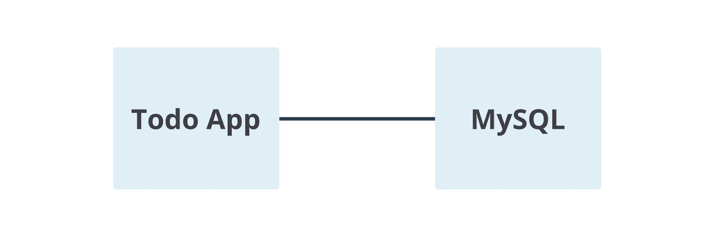
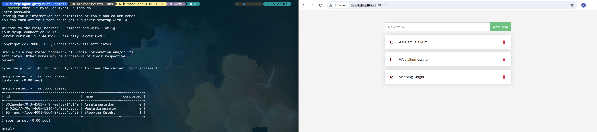

# Part 1: Preparation

**Step 1:** Open Terminal/CMD on your computer, navigate to the desired directory, then **clone** the following [repository](https://github.com/kandlagifari/microservices-labs/tree/todo-app) (in the **todo-app** branch).

**Step 2:** Open **Visual Studio Code**, click **File -> Open Folder…**, select the **microservices-labs** folder that you cloned, click the **Open** button.

**Step 3:** Next, create a **Dockerfile** file (without extension) which will later be used to build the image. Copy the following lines of code to the Dockerfile.
```Dockerfile
FROM node:12-alpine

RUN apk add --no-cache python2 g++ make

WORKDIR /app

COPY . .

RUN yarn install --production

CMD ["node", "src/index.js"]

EXPOSE 3000
```

The following is an explanation of each line of the Dockerfile.
- **FROM node:12-alpine:** Docker will download/fetch a base image named node from Docker Hub with the tag **12-alpine**. If it has been downloaded before, Docker will fetch it from local.
- **RUN apk add --no-cache python2 g++ make:** We install several packages such as python2, g++, and make.
- **WORKDIR /app:** We create a new directory called app inside the container and make it the *working directory*. That way, whatever instructions we write in the next line, will be executed in this /app directory.
- **COPY . .:** The first dot indicates the source, while the second dot indicates the *destination*. That means, we copy all the files in the current local working directory (for example, **/home/sleepingknight/microservices-labs** which contains two folders: spec and src; as well as three files: Dockerfile, package.json, and yarn.lock) to the container working directory (i.e., **/app**).
- **RUN yarn install --production:** We run the **yarn install --production** command to install various dependencies required by the Todo App application in the production environment (in addition to the **devDependecies** section in the package.json file).
- **CMD ["node", "src/index.js"]:** We execute the command to run the Todo App application, namely **["node", "src/index.js"]** which means **node src/index.js** when in the shell.
- **EXPOSE 3000:** Because in the **src/index.js** file we specified that the application runs on port 3000, here we also expose the port that will be used by the container, namely **3000**.

**Step 4:** Once you understand the contents of the Dockerfile, don't forget to save it with **CTRL+S**. 

**Step 5:** Then, open a terminal in Visual Studio Code by selecting **Terminal -> New Terminal**. You will be immediately directed to the current *working directory*.

**Step 6:** Now, build a Docker image using the previously created Dockerfile with the name **todo-app** and the **v1** tag.
```shell
docker build -t todo-app:v1 .
```

**Step 7:** OK, now we have a Docker image on local. Let's run a container from the image.
```shell
docker run -dp 30002:3000 --name todo-app todo-app:v1
```

In the command above, we run the new container in **detach mode** (running in the background), create a **port mapping** between **port 30002 on the host** and **port 3000 on the container**, give it the name **todo-app**, and use the image **todo-app:v1**.


**Step 8:** Next, open the address http://{{Public-IP}}:300022/ in a web browser. Soon, the Todo App will appear there.


**Step 9:** Please add some items you want. You can also check an item to mark it as complete or press the red trash icon to delete it.


# Part 2: Modifying Applications

**Step 1:** In Visual Studio Code, open the **src/static/js/app.js** file.

**Step 2:** After that, replace the text **“No items yet! Add one above!”** to **“You have no todo items yet! Add one above!”**.


Don't forget to save by pressing **CTRL+S**.

**Step 3:** Next, in the VS Code terminal, build an image to apply the modifications just now with the name **todo-app** and tag **v2**.
```shell
docker build -t todo-app:v2 .
```

**Step 4:** After the build process is complete, we need to run a new container using the image that was created earlier. However, we must stop the previous container first to avoid failure because the container name and port used are exactly the same.
```shell
docker rm -f todo-app
```
The command above functions to stop and delete containers.

**Step 5:** Well, now let's run the container.
```shell
docker run -dp 30002:3000 --name todo-app todo-app:v2
```


**Step 6:** Open the address http://{{Public-IP}}:30002/ again in a web browser. Surely you will see the changes.


You have successfully updated the Todo App application code!

Are you aware? When we reopened the Todo App (http://{{Public-IP}}:30002/), it turned out that all the items we had previously created had disappeared! This happens because we have deleted the previous container and run a new container with the new image. Therefore, when accessed, the Todo App application is like a new born baby. Clean!

In the future, we will learn to add volumes so that items in the application remain even if the previous container has been deleted.


# Part 3: Adding Volumes for SQLite

In the previous stage, we noticed that all items in the Todo App application were deleted when launching a new container. You will already understand this thanks to studying the Storage in Docker material. Therefore, we need storage for the Todo App application. In this exercise, we will choose volume. 

Volumes provide the ability to connect a specific path from a container's filesystem to the host machine. If a directory in a container is *mounted*, changes in that directory can also be seen on the host machine. In fact, if we use the same volume for all containers, we can see the same files in each container.

By default, the Todo App application will store data in a [SQLite Database](https://www.sqlite.org/index.html) at **/etc/todos/todo.db** in the container's filesystem (please check the **src/persistence/sqlite.js** file).


SQLite is a relational database that stores all data into a single file. SQLite is often used for development, demos or small scale applications so it is suitable for our current Todo App. 

Note: Later we will discuss how to use different database engines such as MySQL which are suitable for production or large scale applications. 

By creating a volume and attaching it (aka "mounting") to a container, SQLite can store data to that volume so that the data will not be lost even if the container is deleted. 

When SQLite (in the container) saves data to the todo.db file, the file is also stored on the host. This means that we can also check the data from the host machine.

OK, just follow the steps below.

**Step 1:** Create a volume with the name **todo-db**.
```shell
docker volume create todo-db
```

**Step 2:** Then, stop and delete the previous todo-app container because it doesn't use volumes yet.
```shell
docker rm -f todo-app
```

**Step 3** Run a new container for Todo App, but this time add the **-v** option to include volumes.
```shell
docker run -dp 30002:3000 --name todo-app -v todo-db:/etc/todos todo-app:v2
```

**Step 4:** Access the Todo App again via http://{{Public-IP}}:30002/. Try adding as many items as you like.


**Step 5:** Let's test whether this time the item still exists when the container is deleted. Please stop and delete the **todo-app** container.
```shell
docker rm -f todo-app
```

**Step 6:** Next, run a new container using the same command as before.
```shell
docker run -dp 30002:3000 --name todo-app -v todo-db:/etc/todos todo-app:v2
```

**Step 7:** Access Todo App again via http://{{Public-IP}}:30002/. You will see that the items that have been created previously are still *perched* there. Cool! You can now store data persistently.


# Part 4: Added New Container for MySQL

Even though SQLite is a good option for storing relational data for Todo App applications, we also have to learn about other database engines that are generally used for large-scale applications, one of which is MySQL.

However, how do you install MySQL in a container? Do we put it in the todo-app container (like SQLite) or do we place it in a different container? What are the best practices?

Okay. Remember that we are currently learning to build a microservices architecture. In principle, each service (in this case a container) should only do one thing. 

Therefore, we will update the Todo App architecture to be as follows.



One question arises, how do we connect the application with the database as shown above? We think you already know the answer. Networking! We have learned about this in the Networking material on Docker. 

By connecting two containers to the same network, they can communicate with each other. That's what we're going to do here. 

Before starting, let's delete the todo-app container first because we will create a new one later.
```shell
docker rm -f todo-app
```

**Step 1:** First, let's create a bridge type custom network with the name todo-app.
```shell
docker network create todo-app


# 913c26dc0da7e39455d3bf0ec429b420ab9954475c2ca3b110f418627b8a3d16
```

**Step 2:** If we don't specify a type when creating the network, Docker automatically identifies it as a bridge network. Please check with the following command.
```shell
docker network ls


# NETWORK ID     NAME       DRIVER    SCOPE
# 63a952257868   bridge     bridge    local
# e027f91bb219   host       host      local
# 18eac7dec809   none       null      local
# 913c26dc0da7   todo-app   bridge    local
```

**Step 3:** Now, run a new container for MySQL called **mysql-db**, attach the network you created earlier (as well as create an alias or other name for the **todo-app** network, namely **mysql**), and create a new volume called **todo-mysql-data** and simultaneously attach it to the directory **/var/lib/mysql** in the container (which is the location MySQL writes data to by default).

```shell
docker run -d \
     --name mysql-db \
     --network todo-app --network-alias mysql \
     -v todo-mysql-data:/var/lib/mysql \
     -e MYSQL_ROOT_PASSWORD=password \
     -e MYSQL_DATABASE=todo-db \
     mysql:5.7


# Unable to find image 'mysql:5.7' locally
# 5.7: Pulling from library/mysql
# 20e4dcae4c69: Pull complete
# 1c56c3d4ce74: Pull complete
# e9f03a1c24ce: Pull complete
# 68c3898c2015: Pull complete
# 6b95a940e7b6: Pull complete
# 90986bb8de6e: Pull complete
# ae71319cb779: Pull complete
# ffc89e9dfd88: Pull complete
# 43d05e938198: Pull complete
# 064b2d298fba: Pull complete
# df9a4d85569b: Pull complete
# Digest: sha256:4bc6bc963e6d8443453676cae56536f4b8156d78bae03c0145cbe47c2aad73bb
# Status: Downloaded newer image for mysql:5.7
# 737114878cec4da05632a5ea01102c7ee367344a2c1ea8a82b6623fbe192537d
```

In the command above, we also define several environment variables such as the root password and database name (marked with the -e option) that will be used by the database to initialize the database. In addition, we use the **mysql version 5.7** image taken from Docker Hub.


**Step 4:** After the **mysql** container has been successfully created, go into it to test whether our database is running normally.

```shell
docker exec -it mysql-db mysql -u root -p


# Enter password:
# Welcome to the MySQL monitor.  Commands end with ; or \g.
# Your MySQL connection id is 2
# Server version: 5.7.44 MySQL Community Server (GPL)

# Copyright (c) 2000, 2023, Oracle and/or its affiliates.

# Oracle is a registered trademark of Oracle Corporation and/or its
# affiliates. Other names may be trademarks of their respective
# owners.

# Type 'help;' or '\h' for help. Type '\c' to clear the current input statement.

# mysql>
```

Note, **mysql-db** is the name of the container, while **mysql -u root -p** is the command to connect to MySQL using a user (-u) named **root** and a **password** (-p) which will be typed in the terminal. When the password input prompt appears, please enter the *password*. You will also be connected to MySQL.

**Step 5:** Once inside the MySQL container, run the command below to display a list of available databases. Make sure there is a database called todo-db that we created previously.

```shell
SHOW DATABASES;


# mysql> SHOW DATABASES;
# +--------------------+
# | Database           |
# +--------------------+
# | information_schema |
# | mysql              |
# | performance_schema |
# | sys                |
# | todo-db            |
# +--------------------+
# 5 rows in set (0.00 sec)
```

**Step 6:** OK, safe. Exit the container with the **exit** command.

**Step 7:** We now know that the MySQL database is active and ready to use. However, how can it be accessed by the Todo App? Do you remember that we previously used the **--network-alias mysql** option when creating the MySQL container? Well, because Todo App and MySQL are on the same network (namely **todo-app** with the alias **mysql**), they can communicate using the container IP address, container name, or even network name. Let's just try it out.

**Step 8:** The Todo App application supports settings for several environment variables to connect to MySQL (please check the **src/persistence/mysql.js** file), including the following.
- **MYSQL_HOST:** hostname where the MySQL server is running (in our case, it could be the IP address of the mysql-db container, the name of the mysql-db container, or the name of the network/network alias).
- **MYSQL_USER:** username used to connect to the MySQL database.
- **MYSQL_PASSWORD:** password used to connect to the MySQL database.
- **MYSQL_DB:** name of the database to connect to.

**Step 9:** Alright, let's get straight to running the container for Todo App.

```shell
docker run -dp 30002:3000 --name todo-app \
   -w /app -v "$(pwd):/app" \
   --network todo-app \
   -e MYSQL_HOST=mysql \
   -e MYSQL_USER=root \
   -e MYSQL_PASSWORD=password \
   -e MYSQL_DB=todo-db \
   node:12-alpine \
   sh -c "yarn install && yarn run dev"


# Unable to find image 'node:12-alpine' locally
# 12-alpine: Pulling from library/node
# df9b9388f04a: Already exists
# 3bf6d7380205: Already exists
# 7939e601ee5e: Already exists
# 31f0fb9de071: Already exists
# Digest: sha256:d4b15b3d48f42059a15bd659be60afe21762aae9d6cbea6f124440895c27db68
# Status: Downloaded newer image for node:12-alpine
# d35fb54eb4cd1a0c744ad9eeada32f822c58958022b48877ab78a65d22f98a08
```

The following is the explanation.
- **docker run -dp 30002:3000 --name todo-app:** we run the container with the name **todo-app** in **detach** mode while exposing port **3000** from the container to port **30002** on the host.

- **-w /app -v "$(pwd):/app":** we specify that the working directory in the container is /app, then attach bind mount storage and mount the **current working directory on the host** to the **/app** directory on containers. Oh yes, because we use bind mount, any changes you make to the application code will be immediately applied to the Todo App without the need to rebuild the image. You only need to reload or refresh the web browser.

- **--network todo-app:** we use a bridge network called **todo-app**.

- **-e MYSQL_HOST=mysql:** we define the environment variable for MySQL hostname with a network alias named **mysql**.

- **-e MYSQL_USER=root:** we define the environment variable for MySQL username with the value **root**. That means, we will use the root user.

- **-e MYSQL_PASSWORD=password:** we define the environment variable for MySQL password with a value **password**. So, the next time you want to connect to MySQL and are asked for a password, you just enter "password".

- **-e MYSQL_DB=todo-db:** we define the environment variable for MySQL database name with the value **todo-db**. So, when you enter the container, you can access a database called **todo-db**.

- **node:12-alpine:** we use an image named **node** with the tag **12-alpine** from Docker Hub.

- **sh -c "yarn install && yarn run dev":** we run two commands when the container is launched, namely **yarn install** (to install all the dependencies required by the Todo App listed in the package.json file) and **yarn run dev** (to run the **nodemon script src/index.js** as stated in the scripts -> dev section of the package.json file).

**Step 10:** Next, let's examine the logs from the container named **todo-app** to see how the Todo App application runs and shows that it is successfully using the MySQL database.

```shell
docker logs todo-app 


# yarn install v1.22.18
# [1/4] Resolving packages...
# warning Resolution field "ansi-regex@5.0.1" is incompatible with requested version "ansi-regex@^2.0.0"
# warning Resolution field "ansi-regex@5.0.1" is incompatible with requested version "ansi-regex@^3.0.0"
# success Already up-to-date.
# Done in 0.49s.
# yarn run v1.22.18
# $ nodemon src/index.js
# [nodemon] 2.0.13
# [nodemon] to restart at any time, enter `rs`
# [nodemon] watching path(s): *.*
# [nodemon] watching extensions: js,mjs,json
# [nodemon] starting `node src/index.js`
# Waiting for mysql:3306.
# Connected!
# Connected to mysql db at host mysql
# Listening on port 3000
```

From the log message above, we can see that behind the scenes the container will **install dependencies**, run the **nodemon src/index.js** command, connect to the container named mysql-db via network alias **mysql** on port **3306**, and run Todo App via port **30002**.

**Step 11:** Then, open the Todo App via http://{{Public-IP}}:30002/ and add some items.

**Step 12:** After that, let's go to the **mysql-db** container to check whether the item you wrote earlier has been saved in MySQL.

```shell
docker exec -it mysql-db mysql -p todo-db
```

**Step 13:** While logging into the container, run the following query.

```shell
select * from todo_items;
```

**Step 14:** Excellent! It turns out that everything we do in the Todo App is stored in this MySQL database.



**Step 15:** Please exit the container by typing **exit**.
