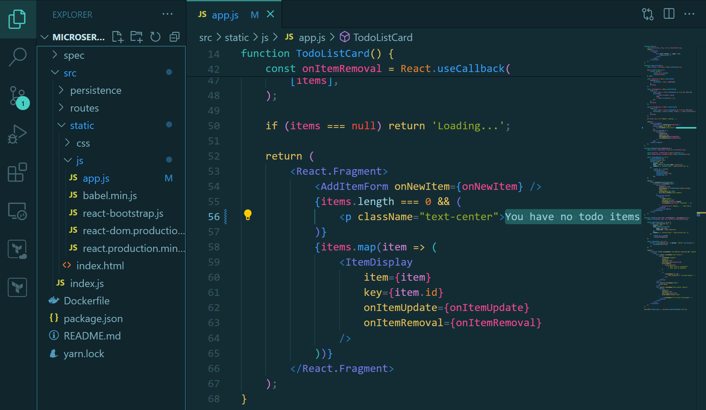

# Part 1: Preparation

**Step 1:** Open Terminal/CMD on your computer, navigate to the desired directory, then **clone** the following [repository](https://github.com/kandlagifari/microservices-labs/tree/todo-app) (in the **todo-app** branch).

**Step 2:** Open **Visual Studio Code**, click **File -> Open Folder…**, select the **microservices-labs** folder that you cloned, click the **Open** button.

**Step 3:** Next, create a **Dockerfile** file (without extension) which will later be used to build the image. Copy the following lines of code to the Dockerfile.
```Dockerfile
FROM node:12-alpine

RUN apk add --no-cache python2 g++ make

WORKDIR /app

COPY . .

RUN yarn install --production

CMD ["node", "src/index.js"]

EXPOSE 3000
```

The following is an explanation of each line of the Dockerfile.
- **FROM node:12-alpine:** Docker will download/fetch a base image named node from Docker Hub with the tag **12-alpine**. If it has been downloaded before, Docker will fetch it from local.
- **RUN apk add --no-cache python2 g++ make:** We install several packages such as python2, g++, and make.
- **WORKDIR /app:** We create a new directory called app inside the container and make it the *working directory*. That way, whatever instructions we write in the next line, will be executed in this /app directory.
- **COPY . .:** The first dot indicates the source, while the second dot indicates the *destination*. That means, we copy all the files in the current local working directory (for example, **/home/sleepingknight/microservices-labs** which contains two folders: spec and src; as well as three files: Dockerfile, package.json, and yarn.lock) to the container working directory (i.e., **/app**).
- **RUN yarn install --production:** We run the **yarn install --production** command to install various dependencies required by the Todo App application in the production environment (in addition to the **devDependecies** section in the package.json file).
- **CMD ["node", "src/index.js"]:** We execute the command to run the Todo App application, namely **["node", "src/index.js"]** which means **node src/index.js** when in the shell.
- **EXPOSE 3000:** Because in the **src/index.js** file we specified that the application runs on port 3000, here we also expose the port that will be used by the container, namely **3000**.

**Step 4:** Once you understand the contents of the Dockerfile, don't forget to save it with **CTRL+S**. 

**Step 5:** Then, open a terminal in Visual Studio Code by selecting **Terminal -> New Terminal**. You will be immediately directed to the current *working directory*.

**Step 6:** Now, build a Docker image using the previously created Dockerfile with the name **todo-app** and the **v1** tag.
```shell
docker build -t todo-app:v1 .
```

**Step 7:** OK, now we have a Docker image on local. Let's run a container from the image.
```shell
docker run -dp 30002:3000 --name todo-app todo-app:v1
```

In the command above, we run the new container in **detach mode** (running in the background), create a **port mapping** between **port 30002 on the host** and **port 3000 on the container**, give it the name **todo-app**, and use the image **todo-app:v1**.


**Step 8:** Next, open the address http://{{Public-IP}}:300022/ in a web browser. Soon, the Todo App will appear there.


**Step 9:** Please add some items you want. You can also check an item to mark it as complete or press the red trash icon to delete it.


# Part 2: Modifying Applications

**Step 1:** In Visual Studio Code, open the **src/static/js/app.js** file.

**Step 2:** After that, replace the text **“No items yet! Add one above!”** to **“You have no todo items yet! Add one above!”**.



Don't forget to save by pressing **CTRL+S**.

**Step 3:** Next, in the VS Code terminal, build an image to apply the modifications just now with the name **todo-app** and tag **v2**.
```shell
docker build -t todo-app:v2 .
```

**Step 4:** After the build process is complete, we need to run a new container using the image that was created earlier. However, we must stop the previous container first to avoid failure because the container name and port used are exactly the same.
```shell
docker rm -f todo-app
```
The command above functions to stop and delete containers.

**Step 5:** Well, now let's run the container.
```shell
docker run -dp 30002:3000 --name todo-app todo-app:v2
```


**Step 6:** Open the address http://{{Public-IP}}:30002/ again in a web browser. Surely you will see the changes.


You have successfully updated the Todo App application code!

Are you aware? When we reopened the Todo App (http://{{Public-IP}}:30002/), it turned out that all the items we had previously created had disappeared! This happens because we have deleted the previous container and run a new container with the new image. Therefore, when accessed, the Todo App application is like a new born baby. Clean!

In the future, we will learn to add volumes so that items in the application remain even if the previous container has been deleted.


# Part 3: Adding Volumes for SQLite

In the previous stage, we noticed that all items in the Todo App application were deleted when launching a new container. You will already understand this thanks to studying the Storage in Docker material. Therefore, we need storage for the Todo App application. In this exercise, we will choose volume. 

Volumes provide the ability to connect a specific path from a container's filesystem to the host machine. If a directory in a container is *mounted*, changes in that directory can also be seen on the host machine. In fact, if we use the same volume for all containers, we can see the same files in each container.

By default, the Todo App application will store data in a [SQLite Database](https://www.sqlite.org/index.html) at **/etc/todos/todo.db** in the container's filesystem (please check the **src/persistence/sqlite.js** file).


SQLite is a relational database that stores all data into a single file. SQLite is often used for development, demos or small scale applications so it is suitable for our current Todo App. 

Note: Later we will discuss how to use different database engines such as MySQL which are suitable for production or large scale applications. 

By creating a volume and attaching it (aka "mounting") to a container, SQLite can store data to that volume so that the data will not be lost even if the container is deleted. 

When SQLite (in the container) saves data to the todo.db file, the file is also stored on the host. This means that we can also check the data from the host machine.

OK, just follow the steps below.

**Step 1:** Create a volume with the name **todo-db**.
```shell
docker volume create todo-db
```

**Step 2:** Then, stop and delete the previous todo-app container because it doesn't use volumes yet.
```shell
docker rm -f todo-app
```

**Step 3** Run a new container for Todo App, but this time add the **-v** option to include volumes.
```shell
docker run -dp 30002:3000 --name todo-app -v todo-db:/etc/todos todo-app:v2
```

**Step 4:** Access the Todo App again via http://{{Public-IP}}:30002/. Try adding as many items as you like.


**Step 5:** Let's test whether this time the item still exists when the container is deleted. Please stop and delete the **todo-app** container.
```shell
docker rm -f todo-app
```

**Step 6:** Next, run a new container using the same command as before.
```shell
docker run -dp 30002:3000 --name todo-app -v todo-db:/etc/todos todo-app:v2
```

**Step 7:** Access Todo App again via http://{{Public-IP}}:30002/. You will see that the items that have been created previously are still *perched* there. Cool! You can now store data persistently.


