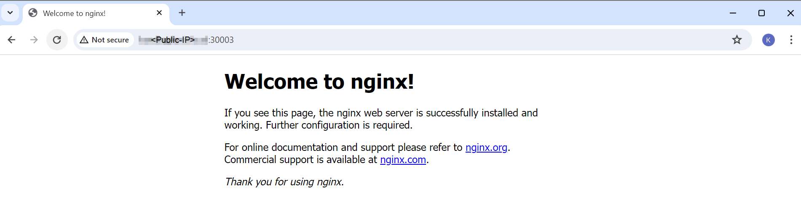
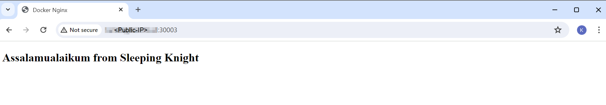
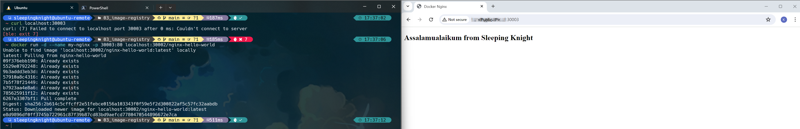
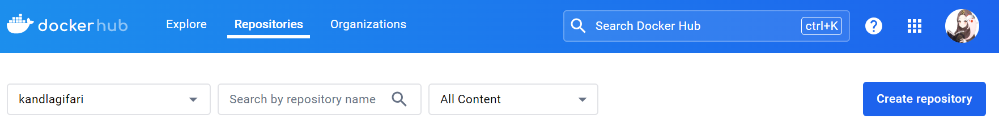
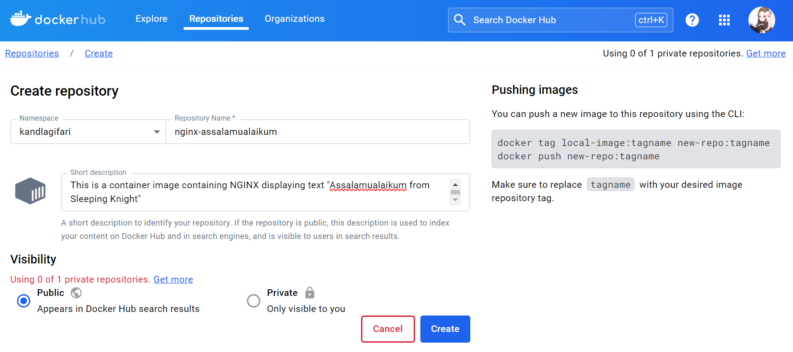
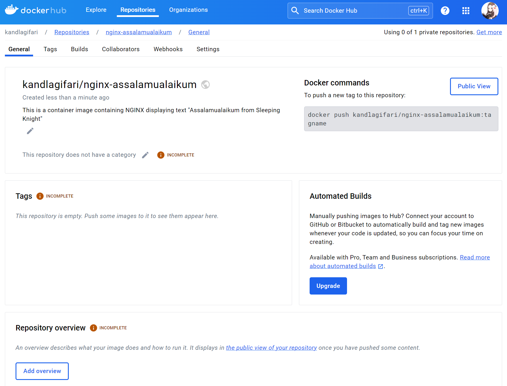
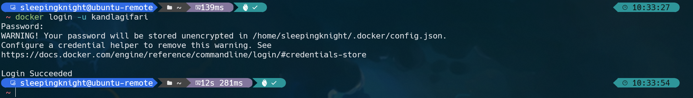
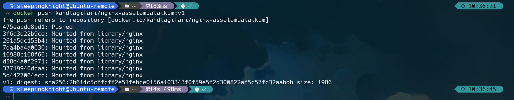
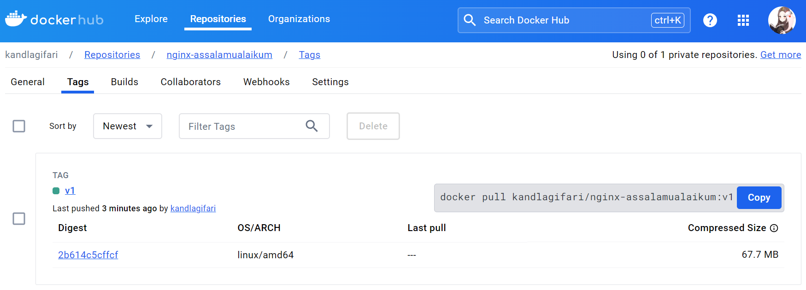
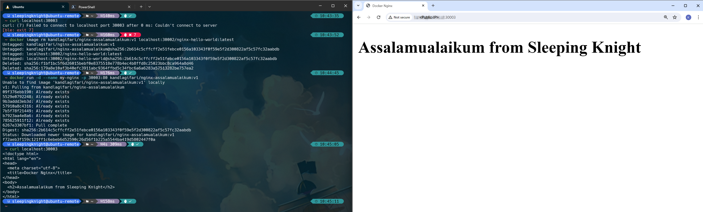

# Part 1: Saving Docker Image to Docker Registry

**Step 1:** This is the command to run the container for Docker Registry. Please run it in terminal.
```shell
docker run -d -p 30002:5000 --restart=always --name registry registry:2


# Unable to find image 'registry:2' locally
# 2: Pulling from library/registry
# 619be1103602: Pull complete
# 862815ae87dc: Pull complete
# 74e12953df95: Pull complete
# 6f0ce73649a0: Pull complete
# ef4f267ce8ed: Pull complete
# Digest: sha256:4fac7a8257b1d7a86599043fcc181dfbdf9c8f57e337db763ac94b0e67c6cfb5
# Status: Downloaded newer image for registry:2
# 888809a73c3f90685885f44805c268f1c2222d91e8280141197ad90d26d9b957
```

In the command above, we run the Docker Registry container in detach mode, on port 30002, named registry, and use the registry image with tag 2 from Docker Hub. The --restart=always option is used so that the container always restarts when it stops.

**Step 2:** OK, at this point **Docker Registry** is ready to use. Next, run the NGINX container.
```shell
docker run -d --name my-nginx -p 30003:80 nginx


# Unable to find image 'nginx:latest' locally
# latest: Pulling from library/nginx
# 09f376ebb190: Pull complete
# 5529e0792248: Pull complete
# 9b3addd3eb3d: Pull complete
# 57910a8c4316: Pull complete
# 7b5f78f21449: Pull complete
# b7923aa4e8a6: Pull complete
# 785625911f12: Pull complete
# Digest: sha256:0f04e4f646a3f14bf31d8bc8d885b6c951fdcf42589d06845f64d18aec6a3c4d
# Status: Downloaded newer image for nginx:latest
# ac7e4ef001fd6d87a2020cb972eb1d316eea97233446f3f53cf4f817cdadfb67
```

The command above will run a container called my-nginx in the background with port 30003 using an image called nginx from Docker Hub.

**Step 3:** Then, try opening your web browser and typing http://{{Public-IP}}:30003/. You will see a “Welcome to nginx!” page.



**Step 4:** So, we will modify this page to display the text "Hello, World!". So, please create a new file called **index.html** using the terminal.
```shell
nano index.html
```

You can also create files using Visual Studio Code, Notepad, or any text editor. The important thing is that you must always remember the directory where the file is located.

**Step 5:** After that, copy the following lines of code to the **index.html** file
```html
<!doctype html>
<html lang="en">
<head>
  <meta charset="utf-8">
  <title>Docker Nginx</title>
</head>
<body>
  <h2>Assalamualaikum from Sleeping Knight</h2>
</body>
</html>
```

You can also add various other texts if you want. If so, save the file by pressing **CTRL+X**, then **Y**, and **Enter**.

**Step 6:** OK, let's continue copying the **index.html** file into the **my-nginx** container with this command.
```shell
docker cp index.html my-nginx:/usr/share/nginx/html 


# Successfully copied 2.05kB to my-nginx:/usr/share/nginx/html
```

**Step 7:** Try accessing the address http://{{Public-IP}}:30003/ again in a web browser.



Excellent! Now, the image from NGINX has been modified according to our wishes. Time to save to Docker Registry!

**Step 8:** Before that, do a commit first to create an image called **nginx-hello-world** from the **my-nginx** container.
```shell
docker commit my-nginx nginx-hello-world


# sha256:f1bf1bc5f6d26015bebf0e8375518e778b4ec4b8ffd8c25023bbc8ca964a8d46
```

**Step 9:** Make sure the image named **nginx-hello-world** is available locally.
```shell
docker images


# REPOSITORY            TAG         IMAGE ID       CREATED          SIZE
# nginx-hello-world     latest      f1bf1bc5f6d2   18 seconds ago   188MB
# nginx                 latest      4f67c83422ec   2 weeks ago      188MB
# registry              2           d6b2c32a0f14   8 months ago     25.4MB
```

**Step 10:** Next, to save the image to the Docker Registry, we must change the name of the image to the location where the Docker Registry is located (i.e. hostname and port) and then end with the desired image name (a.k.a repository). Since we are installing Docker Registry locally via port 30002, the commands that can be used are as follows.
```shell
docker tag nginx-hello-world localhost:30002/nginx-hello-world
```

**Step 11:** Make sure the image named **localhost:30002/nginx-hello-world** is available locally.
```shell
docker images


# REPOSITORY                          TAG         IMAGE ID       CREATED         SIZE
# nginx-hello-world                   latest      f1bf1bc5f6d2   3 minutes ago   188MB
# localhost:30002/nginx-hello-world   latest      f1bf1bc5f6d2   3 minutes ago   188MB
# nginx                               latest      4f67c83422ec   2 weeks ago     188MB
# registry                            2           d6b2c32a0f14   8 months ago    25.4MB
```

**Step 12:** Image is ready. It's time for us to upload it to Docker Registry.
```shell
docker push localhost:30002/nginx-hello-world


# Using default tag: latest
# The push refers to repository [localhost:30002/nginx-hello-world]
# 475eabdd8bd1: Pushed
# 3f6a3d22b9ce: Pushed
# 261a5dc153b4: Pushed
# 7da4ba4a0030: Pushed
# 10988c108f66: Pushed
# d58e4a0f2971: Pushed
# 37719940dcaa: Pushed
# 5d4427064ecc: Pushed
# latest: digest: sha256:2b614c5cffcff2e51febce0156a103343f0f59e5f2d300822af5c57fc32aabdb size: 1986
```

**Step 13:** Cool! The image has been successfully saved in the Docker Registry. To prove it, let's take a look at the contents of the Docker Registry with the help of curl.
```shell
curl -X GET http://localhost:30002/v2/_catalog


# {"repositories":["nginx-hello-world"]}
```

It can be seen that currently an image (a.k.a repository) named **nginx-hello-world** is sitting there. This means that we can run containers locally using this image. Let's try it!

**Step 14:** First delete the containers and images related to NGINX locally so you don't get confused.
```shell
docker stop my-nginx && docker container rm my-nginx && docker image rm nginx-hello-world localhost:30002/nginx-hello-world 


# my-nginx
# my-nginx
# Untagged: nginx-hello-world:latest
# Untagged: localhost:30002/nginx-hello-world:latest
# Untagged: localhost:30002/nginx-hello-world@sha256:2b614c5cffcff2e51febce0156a103343f0f59e5f2d300822af5c57fc32aabdb
# Deleted: sha256:f1bf1bc5f6d26015bebf0e8375518e778b4ec4b8ffd8c25023bbc8ca964a8d46
# Deleted: sha256:179a8e10af3b40efc3911abc9364ffbd5c34fbc6a6a6283a57513282be757ea2
```

**Step 15:** Next, run the container as before, but this time using the image from the Docker Registry.
```shell
docker run -d --name my-nginx -p 30003:80 localhost:30002/nginx-hello-world


# Unable to find image 'localhost:30002/nginx-hello-world:latest' locally
# latest: Pulling from nginx-hello-world
# 09f376ebb190: Already exists
# 5529e0792248: Already exists
# 9b3addd3eb3d: Already exists
# 57910a8c4316: Already exists
# 7b5f78f21449: Already exists
# b7923aa4e8a6: Already exists
# 785625911f12: Already exists
# 6267e3307bf1: Pull complete
# Digest: sha256:2b614c5cffcff2e51febce0156a103343f0f59e5f2d300822af5c57fc32aabdb
# Status: Downloaded newer image for localhost:30002/nginx-hello-world:latest
# e8d9896df0ff3745b722961c87f39b87cd83bd9aefcd7780470544896672e7ca
```

**Step 16:** Please give it a try. Open the address http://{{Public-IP}}:30002/ in a web browser. You will see that this is the Hello World application that we modified earlier. Succeed!



Great, we have succeeded in creating our own container registry (on-premise or self-hosted) using Docker Registry. Next, we will learn to use Docker Hub.

Before continuing, first delete all existing containers.
```shell
docker container stop registry my-nginx && docker container rm -v registry my-nginx


# registry
# my-nginx
# registry
# my-nginx
```


# Part 2: Uploading a Docker Image to Docker Hub

**Step 1:** The first step you must take is to create a Docker Hub account (aka Docker ID). Please create an account first by following the steps on the following [page](https://docs.docker.com/docker-id/). If you already have an account, please log in to [Docker Hub](https://hub.docker.com/).

**Step 2:** When you successfully log in, you will usually be directed to your personal repository page.

**Step 3:** Let's create a new repository by clicking the **Create repository** button.



**Step 4:** On the repository creation page, please fill in the *Repository name* with **nginx-hello-world**, fill in the *Description* column freely, and select **Public** in the *Visibility* section.



If so, click the **Create** button to create a repository.

**Step 5:** Great, you have successfully created a new repository in Docker Hub.



**Step 6:** However, this repository is still empty because there are no images there yet. Therefore, let's upload the image locally.

**Step 7:** Please check your local image listings. There should be an image called **localhost:30002/nginx-hello-world** because it was automatically downloaded when you ran the container using Docker Registry in the previous exercise.

```shell
docker images


# REPOSITORY                          TAG         IMAGE ID       CREATED        SIZE
# localhost:30002/nginx-hello-world   latest      f1bf1bc5f6d2   17 hours ago   188MB
# nginx                               latest      4f67c83422ec   2 weeks ago    188MB
# registry                            2           d6b2c32a0f14   8 months ago   25.4MB
```

**Step 8:** We will change the name of the image (a.k.a repository) and adjust it to the name of the repository in Docker Hub. Please open your terminal and run the following command.
```shell
docker tag localhost:30002/nginx-hello-world <username>/nginx-assalamualaikum:v1
```

Match *{{username}}* with the username of the Docker ID you created. In the command above, we change the image name which previously referred to the Docker Registry to Docker Hub repository accompanied by the v1 tag.
Check your local image list again.

**Step 9:** Check your local images list again.
```shell
docker images


# REPOSITORY                           TAG         IMAGE ID       CREATED        SIZE
# kandlagifari/nginx-assalamualaikum   v1          f1bf1bc5f6d2   17 hours ago   188MB
# localhost:30002/nginx-hello-world    latest      f1bf1bc5f6d2   17 hours ago   188MB
# nginx                                latest      4f67c83422ec   2 weeks ago    188MB
# registry                             2           d6b2c32a0f14   8 months ago   25.4MB
```

The docker tag command does not necessarily delete the image (a.k.a repository) named localhost:30002/nginx-hello-world, instead it will only create a new repository with the name we entered. However, it actually still refers to the same image (pay attention to the image ID between the two).

**Step 10:** Next, we just upload this new image to Docker Hub. However, we need to log in first. If you want to use Terminal, you can run the **docker login** command, then fill in the username and password at the shell prompt. Apart from this method, you can also log in using [Docker credential helpers](https://github.com/docker/docker-credential-helpers) or a [personal access token](https://docs.docker.com/security/for-developers/access-tokens/).

```shell
docker login -u <username>
```



**Step 11:** After successfully logging in, now is the time to upload the image to Docker Hub. Please type the following command.

```shell
docker push <username>/nginx-assalamualaikum:v1
```



**Step 12:** Succeed! Before we check Docker Hub, try paying attention to this line first.
```shell
# The push refers to repository [docker.io/kandlagifari/nginx-assalamualaikum]
```

That means, our image is uploaded to a registry called **docker.io** (aka Docker Hub), with the namespace **kandlagifari** (username), and the repository **nginx-assalamualaikum**. 

**Step 13:** OK, now let's look back at the Docker Hub page, please *refresh* the page or access your **nginx-assalamualaikum** repository again. Go to the **Tags** section and you will see that **nginx-assalamualaikum:v1** is already available there.



**Step 14:** Let's test it. Back in the terminal, delete all images related to **nginx-assalamualaikum**.
```shell
docker image rm <username>/nginx-asalamualaikum:v1 localhost:30002/nginx-hello-world:latest
```

**Step 15:** Then, run the container using the image from your public repository.
```shell
docker run -d --name my-nginx -p 30003:80 kandlagifari/nginx-assalamualaikum:v1
```



Cool! You have successfully created a repository in Docker Hub, uploaded the Docker image to Docker Hub, and run the container using the image from Docker Hub.

Before continuing to the next material, don't forget to delete all resources with the following command.

```shell
docker stop my-nginx && docker container rm my-nginx && docker image rm kandlagifari/nginx-assalamualaikum:v1


# my-nginx
# my-nginx
# Untagged: kandlagifari/nginx-assalamualaikum:v1
# Untagged: kandlagifari/nginx-assalamualaikum@sha256:2b614c5cffcff2e51febce0156a103343f0f59e5f2d300822af5c57fc32aabdb
# Deleted: sha256:f1bf1bc5f6d26015bebf0e8375518e778b4ec4b8ffd8c25023bbc8ca964a8d46
# Deleted: sha256:179a8e10af3b40efc3911abc9364ffbd5c34fbc6a6a6283a57513282be757ea2
```
