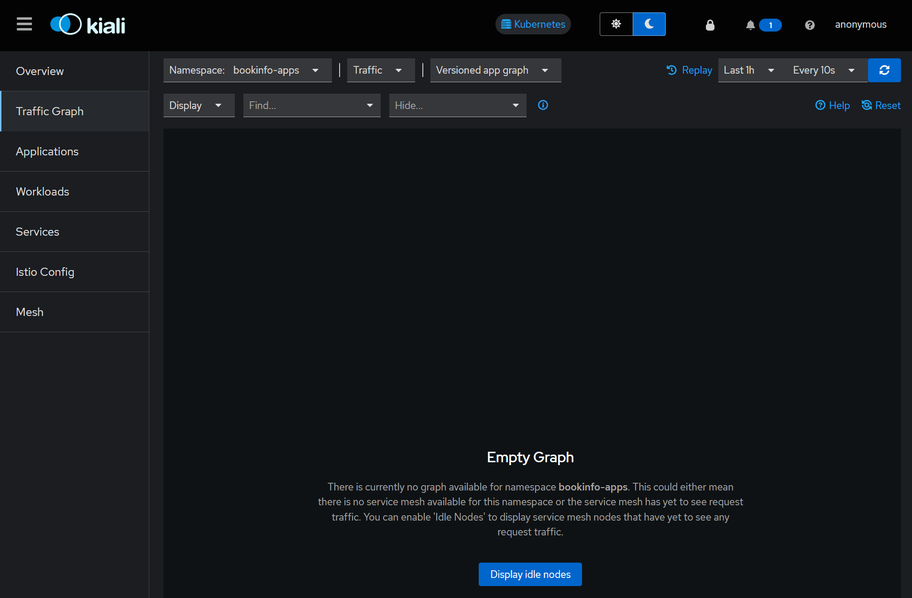
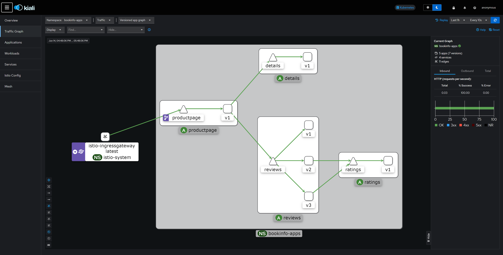
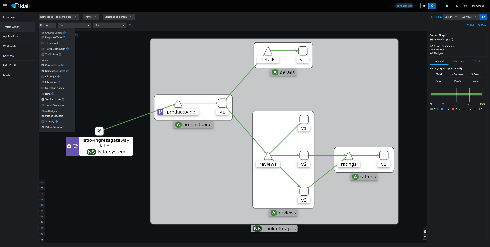
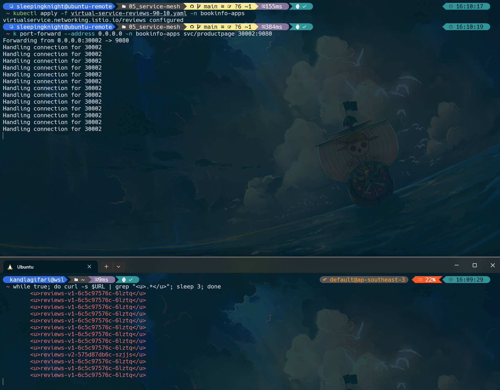

# Part 0: Pre-Req for Load Balancer Service Istio in KIND Cluster

**Step 1:** Make sure you already have Golang installed on your machine. If you don't have it, please follow this [Go](https://go.dev/doc/install) installation guideline

**Step 2:** You can install [cloud-provider-kind](https://github.com/kubernetes-sigs/cloud-provider-kind) using go install:
```shell
go install sigs.k8s.io/cloud-provider-kind@latest
```

**Step 3:** This will install the binary in $GOBIN (typically ~/go/bin); you can make it available elsewhere if appropriate:
```
sudo install ~/go/bin/cloud-provider-kind /usr/local/bin
```

**Step 4:** Once your KIND Cluster is ready, you need to remove the special label **node.kubernetes.io/exclude-from-external-load-balancers** on the **control-plane nodes** to be able to access the workloads running on those nodes using a LoadBalancer Service.
```shell
kubectl label node kind-control-plane node.kubernetes.io/exclude-from-external-load-balancers-

# Expected Output
# label "node.kubernetes.io/exclude-from-external-load-balancers" not found.
# node/kind-control-plane not labeled

# OR
# node/kind-control-plane unlabeled
```

**Step 5:** Once the cluster is running, we need to run the **cloud-provider-kind** in a terminal and keep it running. The **cloud-provider-kind** will monitor all your KIND clusters and **Services** with Type **LoadBalancer** and create the corresponding LoadBalancer containers that will expose those Services. (Keep the terminal open)
```shell
cloud-provider-kind
```


# Part 1: Istio installation

**Step 1:** Visit the [Istio release](https://github.com/istio/istio/releases/) page to download the installation files according to the OS you are using. If you are using Linux or macOS, run the following command to download (latest version) and extract it automatically.

```shell
curl -L https://istio.io/downloadIstio | sh -


# Downloading istio-1.22.1 from https://github.com/istio/istio/releases/download/1.22.1/istio-1.22.1-linux-amd64.tar.gz ...

# Istio 1.22.1 Download Complete!

# Istio has been successfully downloaded into the istio-1.22.1 folder on your system.

# Next Steps:
# See https://istio.io/latest/docs/setup/install/ to add Istio to your Kubernetes cluster.

# To configure the istioctl client tool for your workstation,
# add the /home/sleepingknight/istio-1.22.1/bin directory to your environment path variable with:
#          export PATH="$PATH:/home/sleepingknight/istio-1.22.1/bin"

# Begin the Istio pre-installation check by running:
#          istioctl x precheck

# Need more information? Visit https://istio.io/latest/docs/setup/install/
```

**Step 2:** For Linux or macOS users, add **istioctl** (command line tool for managing deployments on Istio service mesh) to your user executable file.

```shell
sudo mv istio-1.22.1/bin/istioctl /usr/bin/istioctl
```

**Step 3:** OK, it's time for us to install Istio. In the process of installing Istio, we will use a **demo** type profile to make it suitable for testing scenarios because it presents Istio functionality with simple resources.

```shell
istioctl install --set profile=demo -y


# ✔ Istio core installed
# ✔ Istiod installed
# ✔ Egress gateways installed
# ✔ Ingress gateways installed
# ✔ Installation complete                                                                                                                        
# Made this installation the default for injection and validation.
```

**Step 4:** Verify istio components by running this command

```shell
kubectl get all -n istio-system


# NAME                                        READY   STATUS    RESTARTS   AGE
# pod/istio-egressgateway-7cfd5c8676-xrndl    1/1     Running   0          96s
# pod/istio-ingressgateway-86f46c495b-smftw   1/1     Running   0          96s
# pod/istiod-f68799b78-7pqmq                  1/1     Running   0          110s

# NAME                           TYPE           CLUSTER-IP      EXTERNAL-IP   PORT(S)                                                                      AGE
# service/istio-egressgateway    ClusterIP      10.96.244.236   <none>        80/TCP,443/TCP                                                               96s
# service/istio-ingressgateway   LoadBalancer   10.96.133.166   <pending>     15021:31375/TCP,80:32650/TCP,443:32593/TCP,31400:30649/TCP,15443:30905/TCP   96s
# service/istiod                 ClusterIP      10.96.243.10    <none>        15010/TCP,15012/TCP,443/TCP,15014/TCP                                        110s

# NAME                                   READY   UP-TO-DATE   AVAILABLE   AGE
# deployment.apps/istio-egressgateway    1/1     1            1           96s
# deployment.apps/istio-ingressgateway   1/1     1            1           96s
# deployment.apps/istiod                 1/1     1            1           110s

# NAME                                              DESIRED   CURRENT   READY   AGE
# replicaset.apps/istio-egressgateway-7cfd5c8676    1         1         1       96s
# replicaset.apps/istio-ingressgateway-86f46c495b   1         1         1       96s
# replicaset.apps/istiod-f68799b78                  1         1         1       110s
```

**Step 5:** After that, create a new namespace called **bookinfo-apps** then add a label to that namespace to instruct Istio to automatically *inject* (include) the Envoy sidecar proxy when you deploy the application later.

```shell
kubectl create namespace bookinfo-apps && kubectl label namespace bookinfo-apps istio-injection=enabled


# namespace/bookinfo-apps created
# namespace/bookinfo-apps labeled
```

**Step 6:** You can also verify the namespace label, by running this command
```shell
kubectl get namespace --show-labels


# NAME                 STATUS   AGE    LABELS
# bookinfo-apps        Active   37s    istio-injection=enabled,kubernetes.io/metadata.name=bookinfo-apps
# default              Active   16d    kubernetes.io/metadata.name=default
# istio-system         Active   7m7s   kubernetes.io/metadata.name=istio-system
# kube-node-lease      Active   16d    kubernetes.io/metadata.name=kube-node-lease
# kube-public          Active   16d    kubernetes.io/metadata.name=kube-public
# kube-system          Active   16d    kubernetes.io/metadata.name=kube-system
# local-path-storage   Active   16d    kubernetes.io/metadata.name=local-path-storage
```


# Part 2: Deploy the Bookinfo Application

**Step 1:** Run the following command to copy the lines of code below to the **bookinfo.yaml** file.
```shell
cat <<EOF > bookinfo.yaml
# Details service
apiVersion: v1
kind: Service
metadata:
  name: details
  labels:
    app: details
    service: details
spec:
  ports:
  - port: 9080
    name: http
  selector:
    app: details
---
apiVersion: v1
kind: ServiceAccount
metadata:
  name: bookinfo-details
  labels:
    account: details
---
apiVersion: apps/v1
kind: Deployment
metadata:
  name: details-v1
  labels:
    app: details
    version: v1
spec:
  replicas: 1
  selector:
    matchLabels:
      app: details
      version: v1
  template:
    metadata:
      labels:
        app: details
        version: v1
    spec:
      serviceAccountName: bookinfo-details
      containers:
      - name: details
        image: docker.io/istio/examples-bookinfo-details-v1:1.17.0
        imagePullPolicy: IfNotPresent
        ports:
        - containerPort: 9080
        securityContext:
          runAsUser: 1000
---
# Ratings service
apiVersion: v1
kind: Service
metadata:
  name: ratings
  labels:
    app: ratings
    service: ratings
spec:
  ports:
  - port: 9080
    name: http
  selector:
    app: ratings
---
apiVersion: v1
kind: ServiceAccount
metadata:
  name: bookinfo-ratings
  labels:
    account: ratings
---
apiVersion: apps/v1
kind: Deployment
metadata:
  name: ratings-v1
  labels:
    app: ratings
    version: v1
spec:
  replicas: 1
  selector:
    matchLabels:
      app: ratings
      version: v1
  template:
    metadata:
      labels:
        app: ratings
        version: v1
    spec:
      serviceAccountName: bookinfo-ratings
      containers:
      - name: ratings
        image: docker.io/istio/examples-bookinfo-ratings-v1:1.17.0
        imagePullPolicy: IfNotPresent
        ports:
        - containerPort: 9080
        securityContext:
          runAsUser: 1000
---
# Reviews service
apiVersion: v1
kind: Service
metadata:
  name: reviews
  labels:
    app: reviews
    service: reviews
spec:
  ports:
  - port: 9080
    name: http
  selector:
    app: reviews
---
apiVersion: v1
kind: ServiceAccount
metadata:
  name: bookinfo-reviews
  labels:
    account: reviews
---
apiVersion: apps/v1
kind: Deployment
metadata:
  name: reviews-v1
  labels:
    app: reviews
    version: v1
spec:
  replicas: 1
  selector:
    matchLabels:
      app: reviews
      version: v1
  template:
    metadata:
      labels:
        app: reviews
        version: v1
    spec:
      serviceAccountName: bookinfo-reviews
      containers:
      - name: reviews
        image: docker.io/istio/examples-bookinfo-reviews-v1:1.17.0
        imagePullPolicy: IfNotPresent
        env:
        - name: LOG_DIR
          value: "/tmp/logs"
        ports:
        - containerPort: 9080
        volumeMounts:
        - name: tmp
          mountPath: /tmp
        - name: wlp-output
          mountPath: /opt/ibm/wlp/output
        securityContext:
          runAsUser: 1000
      volumes:
      - name: wlp-output
        emptyDir: {}
      - name: tmp
        emptyDir: {}
---
apiVersion: apps/v1
kind: Deployment
metadata:
  name: reviews-v2
  labels:
    app: reviews
    version: v2
spec:
  replicas: 1
  selector:
    matchLabels:
      app: reviews
      version: v2
  template:
    metadata:
      labels:
        app: reviews
        version: v2
    spec:
      serviceAccountName: bookinfo-reviews
      containers:
      - name: reviews
        image: docker.io/istio/examples-bookinfo-reviews-v2:1.17.0
        imagePullPolicy: IfNotPresent
        env:
        - name: LOG_DIR
          value: "/tmp/logs"
        ports:
        - containerPort: 9080
        volumeMounts:
        - name: tmp
          mountPath: /tmp
        - name: wlp-output
          mountPath: /opt/ibm/wlp/output
        securityContext:
          runAsUser: 1000
      volumes:
      - name: wlp-output
        emptyDir: {}
      - name: tmp
        emptyDir: {}
---
apiVersion: apps/v1
kind: Deployment
metadata:
  name: reviews-v3
  labels:
    app: reviews
    version: v3
spec:
  replicas: 1
  selector:
    matchLabels:
      app: reviews
      version: v3
  template:
    metadata:
      labels:
        app: reviews
        version: v3
    spec:
      serviceAccountName: bookinfo-reviews
      containers:
      - name: reviews
        image: docker.io/istio/examples-bookinfo-reviews-v3:1.17.0
        imagePullPolicy: IfNotPresent
        env:
        - name: LOG_DIR
          value: "/tmp/logs"
        ports:
        - containerPort: 9080
        volumeMounts:
        - name: tmp
          mountPath: /tmp
        - name: wlp-output
          mountPath: /opt/ibm/wlp/output
        securityContext:
          runAsUser: 1000
      volumes:
      - name: wlp-output
        emptyDir: {}
      - name: tmp
        emptyDir: {}
---
# Productpage services
apiVersion: v1
kind: Service
metadata:
  name: productpage
  labels:
    app: productpage
    service: productpage
spec:
  ports:
  - port: 9080
    name: http
  selector:
    app: productpage
---
apiVersion: v1
kind: ServiceAccount
metadata:
  name: bookinfo-productpage
  labels:
    account: productpage
---
apiVersion: apps/v1
kind: Deployment
metadata:
  name: productpage-v1
  labels:
    app: productpage
    version: v1
spec:
  replicas: 1
  selector:
    matchLabels:
      app: productpage
      version: v1
  template:
    metadata:
      labels:
        app: productpage
        version: v1
    spec:
      serviceAccountName: bookinfo-productpage
      containers:
      - name: productpage
        image: docker.io/istio/examples-bookinfo-productpage-v1:1.17.0
        imagePullPolicy: IfNotPresent
        ports:
        - containerPort: 9080
        volumeMounts:
        - name: tmp
          mountPath: /tmp
        securityContext:
          runAsUser: 1000
      volumes:
      - name: tmp
        emptyDir: {}
---
EOF
```

The manifest file above contains definitions of Kubernetes service, Kubernetes service account, and Kubernetes deployment for the 4 services we discussed at the beginning, namely details, ratings, reviews (has three versions), and productpage. Please pay attention to as much detail as possible.

**Step 2:** Next, deploy the Kubernetes manifest.
```shell
kubectl apply -f bookinfo.yaml -n bookinfo-apps


# service/details created
# serviceaccount/bookinfo-details created
# deployment.apps/details-v1 created
# service/ratings created
# serviceaccount/bookinfo-ratings created
# deployment.apps/ratings-v1 created
# service/reviews created
# serviceaccount/bookinfo-reviews created
# deployment.apps/reviews-v1 created
# deployment.apps/reviews-v2 created
# deployment.apps/reviews-v3 created
# service/productpage created
# serviceaccount/bookinfo-productpage created
# deployment.apps/productpage-v1 created
```

**Step 3:** The Bookinfo application will start running. Take a look at the Kubernetes service for Bookinfo.
```shell
kubectl get svc -n bookinfo-apps


# NAME          TYPE        CLUSTER-IP      EXTERNAL-IP   PORT(S)    AGE
# details       ClusterIP   10.96.80.106    <none>        9080/TCP   78s
# productpage   ClusterIP   10.96.148.182   <none>        9080/TCP   78s
# ratings       ClusterIP   10.96.53.232    <none>        9080/TCP   78s
# reviews       ClusterIP   10.96.116.184   <none>        9080/TCP   78s
```

**Step 4:** See also Kubernetes pod for Bookinfo.
```shell
kubectl get pods -n bookinfo-apps


# NAME                             READY   STATUS    RESTARTS   AGE
# details-v1-6c98bc7c4c-ms9ws      2/2     Running   0          2m56s
# productpage-v1-d5d6d8b8c-gdzzr   2/2     Running   0          2m55s
# ratings-v1-7645575cf9-5sb78      2/2     Running   0          2m56s
# reviews-v1-6c5c97576c-6lztq      2/2     Running   0          2m56s
# reviews-v2-575d87db6c-szjjs      2/2     Running   0          2m56s
# reviews-v3-698c4b8d4c-lm5jf      2/2     Running   0          2m55s
```

Make sure the pod status is Running before continuing to the next stage.

**Step 5:** Verify that everything is working normally. Please run the following command to see if the application is running properly and serving the proper HTML page by checking the page title in the HTTP response.
```shell
kubectl exec "$(kubectl get pod -n bookinfo-apps -l app=ratings -o jsonpath='{.items[0].metadata.name}')" -n bookinfo-apps -c ratings -- curl -sS productpage:9080/productpage | grep -o "<title>.*</title>"


# <title>Simple Bookstore App</title>
```


# Part 3: Installing Istio Ingress Gateway

Now it's time for us to interact with Istio to manage application traffic. First, we will install Istio Ingress Gateway. You can use Istio Ingress Gateway to manage traffic entering the service mesh by determining what is permitted and denied. 

Unlike other mechanisms that also control incoming traffic (for example, the Kubernetes Ingress API), Istio Ingress Gateway allows you to use the full functionality and flexibility of Istio traffic routing. This is because Istio Ingress Gateway allows you to configure layers 4-6 load balancing to expose ports, TLS settings, and so on. Let's go!

**Step 1:** OK, we have successfully deployed the Bookinfo application. Unfortunately, this application cannot be accessed from outside. For this, we need to create an [Istio Ingress Gateway](https://istio.io/latest/docs/concepts/traffic-management/#gateways) which functions to manage network traffic entering your service mesh architecture (see again the Bookinfo application architecture diagram above). Please run the following command to copy the below lines of code to the **bookinfo-gateway.yaml** file.

```shell
cat <<EOF > bookinfo-gateway.yaml
apiVersion: networking.istio.io/v1alpha3
kind: Gateway
metadata:
  name: bookinfo-gateway
spec:
  selector:
    istio: ingressgateway # use istio default controller
  servers:
  - port:
      number: 80
      name: http
      protocol: HTTP
    hosts:
    - "*"
---
apiVersion: networking.istio.io/v1alpha3
kind: VirtualService
metadata:
  name: bookinfo
spec:
  hosts:
  - "*"
  gateways:
  - bookinfo-gateway
  http:
  - match:
    - uri:
        exact: /productpage
    - uri:
        prefix: /static
    - uri:
        exact: /login
    - uri:
        exact: /logout
    - uri:
        prefix: /api/v1/products
    route:
    - destination:
        host: productpage
        port:
          number: 9080
EOF
```

**Step 2:** Just deploy the Kubernetes manifest file.
```shell
kubectl apply -f bookinfo-gateway.yaml -n bookinfo-apps


# gateway.networking.istio.io/bookinfo-gateway created
# virtualservice.networking.istio.io/bookinfo created
```

**Step 3:** Make sure there are no issues with the Istio configuration.
```shell
istioctl analyze


# ✔ No validation issues found when analyzing namespace: default.
```


**Step 4:** The next step is that we need to know the IP address and port of the Istio Ingress Gateway, then save these values ​​to environment variables to make it easier to access the application.

**Step 5:** OK, please open a **new terminal window** (or a new WSL/Ubuntu window) and run the following command in the new terminal window.
```shell
# KIND (In this tutorial, I'm using KIND Cluster)
cloud-provider-kind

# OR

# Minikube
minikube tunnel
```

This command starts the KIND tunnel process which will send traffic to your Istio Ingress Gateway. This process will give us an external load balancer (EXTERNAL-IP) for the Kubernetes service named `istio-ingressgateway` in the **istio-system** namespace.

**Step 6:** Then, we save the necessary values ​​into the environment variables in the previous terminal window (while the Minikube tunnel process continues to run in the new terminal window).
```shell
export INGRESS_HOST=$(kubectl -n istio-system get service istio-ingressgateway -o jsonpath='{.status.loadBalancer.ingress[0].ip}')
export INGRESS_PORT=$(kubectl -n istio-system get service istio-ingressgateway -o jsonpath='{.spec.ports[?(@.name=="http2")].port}')
export SECURE_INGRESS_PORT=$(kubectl -n istio-system get service istio-ingressgateway -o jsonpath='{.spec.ports[?(@.name=="https")].port}')
```

**Step 7:** If you are confused, here is the process.


**Step 8:** If all good, make sure the IP address and port for the Istio Ingress Gateway are successfully saved to each environment variable.
```shell
echo "$INGRESS_HOST" "$INGRESS_PORT" "$SECURE_INGRESS_PORT"


# 172.18.0.3 80 443
```

**Step 9:** Next, determine the value for the environment variable named **GATEWAY_URL** from the previous Istio Ingress Gateway IP address and port values.
```shell
export GATEWAY_URL=$INGRESS_HOST:$INGRESS_PORT
```

**Step 10:** Check whether the IP address and port values ​​for the Istio Ingress Gateway are correctly stored in **GATEWAY_URL**.
```shell
echo "$GATEWAY_URL"


# 172.18.0.3:80
```

**Step 11:** Let's check whether the Bookinfo application can be accessed from outside the cluster. At first, follow these commands to get the external address of the Bookinfo app.
```shell
echo "http://$GATEWAY_URL/productpage"


# http://172.18.0.3:80/productpage
```

**Step 12:** Then, access the address wether using curl command or via a web browser. Make sure the product page of the Bookinfo application appears.
- Curl Command


- Web Browser


Top! The Bookinfo application has been successfully deployed and can be accessed from outside the cluster (our computer) thanks to the help of Istio Ingress Gateway. Next, we will try to access the dashboard so we can analyze the service mesh.


# Part 4: Accessing the Dashboard

Istio is integrated with a number of telemetry collection tools so it can help you gain insight into the service mesh structure, display service mesh topology, and analyze service mesh conditions. 

So, this time we will deploy the [Kiali](https://kiali.io/) dashboard along with a number of other addons such as [Prometheus](https://prometheus.io/), [Grafana](https://grafana.com/), and [Jaeger](https://www.jaegertracing.io/). Let's start.

**Step 1:** Install all addons in the samples/addons directory. Wait until everything is finished creating.

```shell
kubectl apply -f samples/addons
```


**Step 2:** Next, make sure the rollout status for Kiali is successful.
```shell
kubectl rollout status deployment/kiali -n istio-system


# deployment "kiali" successfully rolled out
```

**Step 3:** You can also check the addones components which already deployed, by running this command
```shell
kubectl get all -n istio-system


# NAME                                        READY   STATUS    RESTARTS   AGE
# pod/grafana-657df88ffd-5wpbm                1/1     Running   0          11m
# pod/istio-egressgateway-7cfd5c8676-xrndl    1/1     Running   0          174m
# pod/istio-ingressgateway-86f46c495b-smftw   1/1     Running   0          174m
# pod/istiod-f68799b78-7pqmq                  1/1     Running   0          174m
# pod/jaeger-697d898d6-rr727                  1/1     Running   0          11m
# pod/kiali-5899548ff7-7jnfq                  1/1     Running   0          11m
# pod/loki-0                                  1/1     Running   0          11m
# pod/prometheus-777db476b6-855g9             2/2     Running   0          11m

# NAME                           TYPE           CLUSTER-IP      EXTERNAL-IP   PORT(S)                                                                      AGE
# service/grafana                ClusterIP      10.96.39.40     <none>        3000/TCP                                                                     11m
# service/istio-egressgateway    ClusterIP      10.96.244.236   <none>        80/TCP,443/TCP                                                               174m
# service/istio-ingressgateway   LoadBalancer   10.96.133.166   172.18.0.3    15021:31375/TCP,80:32650/TCP,443:32593/TCP,31400:30649/TCP,15443:30905/TCP   174m
# service/istiod                 ClusterIP      10.96.243.10    <none>        15010/TCP,15012/TCP,443/TCP,15014/TCP                                        174m
# service/jaeger-collector       ClusterIP      10.96.8.161     <none>        14268/TCP,14250/TCP,9411/TCP,4317/TCP,4318/TCP                               11m
# service/kiali                  ClusterIP      10.96.62.14     <none>        20001/TCP,9090/TCP                                                           11m
# service/loki                   ClusterIP      10.96.58.70     <none>        3100/TCP,9095/TCP                                                            11m
# service/loki-headless          ClusterIP      None            <none>        3100/TCP                                                                     11m
# service/loki-memberlist        ClusterIP      None            <none>        7946/TCP                                                                     11m
# service/prometheus             ClusterIP      10.96.114.253   <none>        9090/TCP                                                                     11m
# service/tracing                ClusterIP      10.96.168.157   <none>        80/TCP,16685/TCP                                                             11m
# service/zipkin                 ClusterIP      10.96.115.139   <none>        9411/TCP                                                                     11m

# NAME                                   READY   UP-TO-DATE   AVAILABLE   AGE
# deployment.apps/grafana                1/1     1            1           11m
# deployment.apps/istio-egressgateway    1/1     1            1           174m
# deployment.apps/istio-ingressgateway   1/1     1            1           174m
# deployment.apps/istiod                 1/1     1            1           174m
# deployment.apps/jaeger                 1/1     1            1           11m
# deployment.apps/kiali                  1/1     1            1           11m
# deployment.apps/prometheus             1/1     1            1           11m

# NAME                                              DESIRED   CURRENT   READY   AGE
# replicaset.apps/grafana-657df88ffd                1         1         1       11m
# replicaset.apps/istio-egressgateway-7cfd5c8676    1         1         1       174m
# replicaset.apps/istio-ingressgateway-86f46c495b   1         1         1       174m
# replicaset.apps/istiod-f68799b78                  1         1         1       174m
# replicaset.apps/jaeger-697d898d6                  1         1         1       11m
# replicaset.apps/kiali-5899548ff7                  1         1         1       11m
# replicaset.apps/prometheus-777db476b6             1         1         1       11m

# NAME                    READY   AGE
# statefulset.apps/loki   1/1     11m
```

**Step 4:** Let's just access the Kiali dashboard with this command.
```shell
istioctl dashboard kiali


# http://localhost:20001/kiali
```

**Step 5:** A new browser tab will open displaying the Kiali dashboard. If it doesn't open automatically, please access the URL that appears manually in your browser.

However, I will use port forward, because I will access Kiali Dashboard though Public IP


**Step 6:** In the left navigation menu, select **Traffic Graph**. Click the **Select Namespaces** drop down, then check **bookinfo-apps**.

**Step 7:** To make the trace data visualization process easier, change the *Traffic metrics per refresh* to **Last 1h** and *Refresh interval* to **Every 10s**.



**Step 8:** Didn't see anything? Calm. So, to see trace data, we have to send a number of requests to the application. With a default sampling rate of 1%, we must send at least 100 requests before the first trace can be seen. So, to send 100 requests to the application (to **productpage** service to be precise), first try stopping Kiali dashboard in the terminal (with the CTRL+C combination), then run the following command.

```shell
for i in $(seq 1 100); do curl -s -o /dev/null "http://$GATEWAY_URL/productpage"; done
```

**Step 9:** After that, refresh the Kiali dashboard browser.


**Step 10:** On the Kiali dashboard, press the blue **refresh** button in the top right corner (or wait up to 10 seconds for it to refresh automatically). Voila! Kiali dashboard will display a visualization of your service mesh along with the relationships between services for the Bookinfo application.



**Step 11:** In fact, it also provides filters to make it easier for you to analyze traffic flow on the service mesh.




# Part 5: Implement Request Routing

### Virtual Service and Destination Rule

Virtual services and destination rules are the main components of Istio traffic routing functionality. Virtual services allow you to configure redirection of requests to services within the Istio service mesh. 

Each virtual service consists of a set of routing rules that are evaluated sequentially which makes it easy for Istio to match each request given to the virtual service to a specific service in the service mesh. 

You can use several virtual services or none in a service mesh depending on your needs.

You can think of a virtual service as a way to route traffic to a specific destination, and then you use destination rules to configure what happens to the traffic to that destination. Destination rules will be applied after the virtual service routing rules have been evaluated. 

In practice, destination rules are used to determine subsets, namely a number of services grouped according to version. Then, you can use these service subsets in virtual service routing rules to control traffic to various services for your application. 

Destination rules also allow you to adjust Envoy traffic policies when directing traffic to a destination, such as load balancing models, TLS security modes, or circuit breaker settings.

### Bookinfo Application Review

As you know, the Bookinfo application consists of 4 services: **details**, **ratings**, **reviews**, and **productpage**; where the reviews service has three different versions and all three have been deployed and running simultaneously.

Try accessing the Bookinfo application in a browser and refreshing it several times, you will get a different Book Reviews display. Sometimes it appears without stars, other times the star rating appears in black, and occasionally the star rating appears in red.


How did it happen? If you remember, we discussed this at the beginning of this series of exercises, namely because the **reviews** service has three different versions, here is the explanation.

1. Version v1 does not communicate with **ratings** service.
2. The v2 version communicates with the **ratings** service and displays a rating of 1-5 in the form of black stars.
3. The v3 version communicates with the **ratings** service and displays a rating of 1-5 in the form of red stars.

Apart from that, this is also because we are *deploying* the three versions simultaneously and we have not determined the default service version to route. Therefore, Istio will send requests to all available versions in **round robin** mode so that all versions appear randomly. 

In real cases, of course you don't want it to be like this, right? You'll want your app to only display the latest version consistently to uniform the user experience.

Well, we can solve this problem with Istio through the request routing functionality.


### Implementation of Request Routing Functionality

Therefore, in this exercise, we will apply a rule that routes all traffic to v1 (version 1). Then, you'll also apply rules to route traffic based on HTTP request header values. Let's start!

**Step 1:** First, create a default destination rule for the Bookinfo application. Please run the following command to copy the lines of code below to the **destination-rule-all.yaml** file (if Kiali dashboard is still running, please stop it with CTRL+C).

```shell
cat <<EOF > destination-rule-all.yaml
apiVersion: networking.istio.io/v1alpha3
kind: DestinationRule
metadata:
  name: productpage
spec:
  host: productpage
  subsets:
  - name: v1
    labels:
      version: v1
---
apiVersion: networking.istio.io/v1alpha3
kind: DestinationRule
metadata:
  name: reviews
spec:
  host: reviews
  subsets:
  - name: v1
    labels:
      version: v1
  - name: v2
    labels:
      version: v2
  - name: v3
    labels:
      version: v3
---
apiVersion: networking.istio.io/v1alpha3
kind: DestinationRule
metadata:
  name: ratings
spec:
  host: ratings
  subsets:
  - name: v1
    labels:
      version: v1
  - name: v2
    labels:
      version: v2
  - name: v2-mysql
    labels:
      version: v2-mysql
  - name: v2-mysql-vm
    labels:
      version: v2-mysql-vm
---
apiVersion: networking.istio.io/v1alpha3
kind: DestinationRule
metadata:
  name: details
spec:
  host: details
  subsets:
  - name: v1
    labels:
      version: v1
  - name: v2
    labels:
      version: v2
---
EOF
```

In the manifest file above, we define default routing rules where *all traffic* can be routed to each version for each existing service. 

**Step 2** After that, deploy the manifest file above.

```shell
kubectl apply -f destination-rule-all.yaml -n bookinfo-apps


# destinationrule.networking.istio.io/productpage created
# destinationrule.networking.istio.io/reviews created
# destinationrule.networking.istio.io/ratings created
# destinationrule.networking.istio.io/details created
```

**Step 3:** Wait until the destination rule is successfully implemented. Check by running the following command.

```shell
kubectl get destinationrules -n bookinfo-apps


# NAME          HOST          AGE
# details       details       51s
# productpage   productpage   51s
# ratings       ratings       51s
# reviews       reviews       51s
```

**Step 4:** OK, now we will try to route all traffic only to v1 (version 1) for all services from the Bookinfo application. For this reason, we will configure virtual service routing rules. Please run the following command to copy the below lines of code to the **virtual-service-all-v1.yaml** file.

```shell
cat <<EOF > virtual-service-all-v1.yaml
apiVersion: networking.istio.io/v1alpha3
kind: VirtualService
metadata:
  name: productpage
spec:
  hosts:
  - productpage
  http:
  - route:
    - destination:
        host: productpage
        subset: v1
---
apiVersion: networking.istio.io/v1alpha3
kind: VirtualService
metadata:
  name: reviews
spec:
  hosts:
  - reviews
  http:
  - route:
    - destination:
        host: reviews
        subset: v1
---
apiVersion: networking.istio.io/v1alpha3
kind: VirtualService
metadata:
  name: ratings
spec:
  hosts:
  - ratings
  http:
  - route:
    - destination:
        host: ratings
        subset: v1
---
apiVersion: networking.istio.io/v1alpha3
kind: VirtualService
metadata:
  name: details
spec:
  hosts:
  - details
  http:
  - route:
    - destination:
        host: details
        subset: v1
---
EOF
```

Look at the manifest file above. Here, we define that the route for `productpage` is directed to **v1**, `reviews` to **v1**, `ratings` to **v1**, and `details` to **v1**.

**Step 5:** Next, let's deploy the manifest file for the virtual service.

```shell
kubectl apply -f virtual-service-all-v1.yaml -n bookinfo-apps


# virtualservice.networking.istio.io/productpage created
# virtualservice.networking.istio.io/reviews created
# virtualservice.networking.istio.io/ratings created
# virtualservice.networking.istio.io/details created
```

**Step 6:** Wait until the virtual service is successfully implemented. Check by running the following command.

```shell
kubectl get virtualservice -n bookinfo-apps


# NAME          GATEWAYS               HOSTS             AGE
# bookinfo      ["bookinfo-gateway"]   ["*"]             24h
# details                              ["details"]       22s
# productpage                          ["productpage"]   22s
# ratings                              ["ratings"]       22s
# reviews                              ["reviews"]       22s
```

Nice! You have successfully configured Istio to route all traffic only to version 1 of the Bookinfo application, especially the reviews v1 service. Try accessing the Bookinfo application again in the browser, you will be surprised because every time it refreshes it only displays version 1 (does not display the star rating).


# Part 6: Implementing Traffic Shifting

You have configured Istio to route all **traffic** for the reviews service to version v1. Because this version does not communicate with the **ratings** service, the Bookinfo application does not display star ratings at all in the Book Reviews section.

Suppose a Bookinfo application user provides input to display the star rating in the Book Reviews section. Seeing this, you then deploy the **reviews:v2** service which is able to display star ratings.

However, you want to manage traffic to implement a *canary deployment*. This means that you want the **reviews:v2** service to only be introduced to a small number of users first to test whether the feature works well and is liked by users or not. Then, if everything goes smoothly, you want to gradually increase the traffic percentage for the **reviews:v2** service while slowly removing **reviews:v1**.

Well, fortunately cases like this can be handled by Istio. It is able to provide the controls needed to implement canary deployments. Therefore, this exercise will show you how to do traffic shiting (diverting network traffic) from one version of a service to another.

In Istio, we can implement traffic shifting by configuring virtual service routing rules which can divert a percentage of traffic from one destination to another. Can not wait? Come on, let's just start practicing.

**Step 1:** In the previous exercise, we configured the virtual service to route all traffic to the **reviews:v1** service. Not much different from that, we will also configure a virtual service, but this time to route 90% of traffic to **reviews:v1** and 10% to **reviews:v2**. For that, please run the following command to copy the lines of code below to the manifest file named **virtual-service-reviews-90-10.yaml**.

```shell
cat <<EOF > virtual-service-reviews-90-10.yaml
apiVersion: networking.istio.io/v1alpha3
kind: VirtualService
metadata:
  name: reviews
spec:
  hosts:
    - reviews
  http:
  - route:
    - destination:
        host: reviews
        subset: v1
      weight: 90
    - destination:
        host: reviews
        subset: v2
      weight: 10
EOF
```

**Step 2:** After that, deploy the manifest file.

```shell
kubectl apply -f virtual-service-reviews-90-10.yaml -n bookinfo-apps


# virtualservice.networking.istio.io/reviews configured
```

**Step 3:** Wait until the virtual service is successfully implemented. Check by running the following command.

```shell
kubectl describe virtualservice -n bookinfo-apps reviews


# Name:         reviews
# Namespace:    bookinfo-apps
# Labels:       <none>
# Annotations:  <none>
# API Version:  networking.istio.io/v1
# Kind:         VirtualService
# Metadata:
#   Creation Timestamp:  2024-06-15T08:21:55Z
#   Generation:          2
#   Resource Version:    653719
#   UID:                 db6c2b8e-b7d5-45c8-adf9-a0c0eb1645bf
# Spec:
#   Hosts:
#     reviews
#   Http:
#     Route:
#       Destination:
#         Host:    reviews
#         Subset:  v1
#       Weight:    90
#       Destination:
#         Host:    reviews
#         Subset:  v2
#       Weight:    10
# Events:          <none>
```

**Step 4:** Nice! Try now accessing the Bookinfo application and refresh it several times. You will more often get **reviews:v1** (no star rating) and **reviews:v2** (black star rating) only appearing occasionally. This happens because **reviews:v2** communicates with the ratings service, while **reviews:v1** does not.



**Step 5:** OK, let's say this feature runs smoothly and users like it. You decide to route all user traffic to **reviews:v2**, how do you do that? Simple. Please run the following command to copy the lines of code below to the manifest file named **virtual-service-reviews-v2.yaml**.

```shell
cat <<EOF > virtual-service-reviews-v2.yaml
apiVersion: networking.istio.io/v1alpha3
kind: VirtualService
metadata:
  name: reviews
spec:
  hosts:
    - reviews
  http:
  - route:
    - destination:
        host: reviews
        subset: v2
EOF
```

**Step 6:** Just deploy the manifest file.

```shell
kubectl apply -f virtual-service-reviews-v2.yaml -n bookinfo-apps


# virtualservice.networking.istio.io/reviews configured
```

**Step 7:** Wait until the virtual service is successfully implemented. Check by running the following command.

```shell
kubectl describe virtualservice -n bookinfo-apps reviews


# Name:         reviews
# Namespace:    bookinfo-apps
# Labels:       <none>
# Annotations:  <none>
# API Version:  networking.istio.io/v1
# Kind:         VirtualService
# Metadata:
#   Creation Timestamp:  2024-06-15T08:21:55Z
#   Generation:          3
#   Resource Version:    654144
#   UID:                 db6c2b8e-b7d5-45c8-adf9-a0c0eb1645bf
# Spec:
#   Hosts:
#     reviews
#   Http:
#     Route:
#       Destination:
#         Host:    reviews
#         Subset:  v2
# Events:          <none>
```

**Step 8:** Access the Bookinfo application again and refresh it several times. Now you will only get **reviews:v2** (black star rating). Interesting, right? 


Now, let's say you have developed version 3 of the **reviews** service (i.e. the red star rating) and have deployed it to a Kubernetes cluster. Unlike before, this time you are confident with the feature and want all users to experience it at once without going through the canary deployment process. Sure, you already know how, right?

**Step 9:** First, copy the line of code below to save it to the **virtual-service-reviews-v3.yaml** file.

```shell
cat <<EOF > virtual-service-reviews-v3.yaml
apiVersion: networking.istio.io/v1alpha3
kind: VirtualService
metadata:
  name: reviews
spec:
  hosts:
    - reviews
  http:
  - route:
    - destination:
        host: reviews
        subset: v3
EOF
```

**Step 10:** Next, deploy the manifest file.

```shell
kubectl apply -f virtual-service-reviews-v3.yaml -n bookinfo-apps


# virtualservice.networking.istio.io/reviews configured
```

**Step 11:** Wait until the virtual service is successfully implemented. Check by running the following command.

```shell
kubectl describe virtualservice -n bookinfo-apps reviews


# Name:         reviews
# Namespace:    bookinfo-apps
# Labels:       <none>
# Annotations:  <none>
# API Version:  networking.istio.io/v1
# Kind:         VirtualService
# Metadata:
#   Creation Timestamp:  2024-06-15T08:21:55Z
#   Generation:          4
#   Resource Version:    654271
#   UID:                 db6c2b8e-b7d5-45c8-adf9-a0c0eb1645bf
# Spec:
#   Hosts:
#     reviews
#   Http:
#     Route:
#       Destination:
#         Host:    reviews
#         Subset:  v3
# Events:          <none>
```

**Step 12:** Access the Bookinfo application again and refresh it several times. You will definitely only get **reviews:v3** (red star rating). Break a leg!


