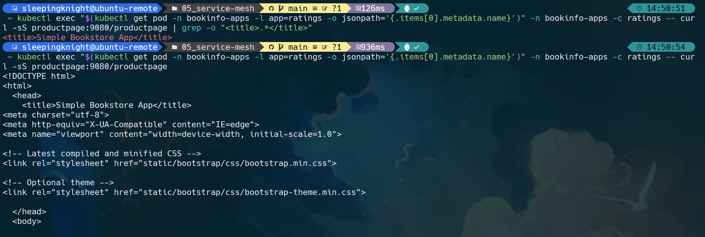
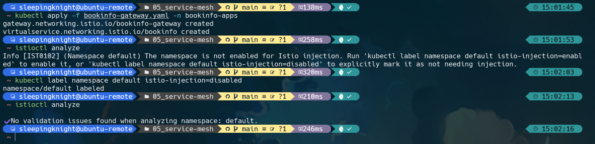
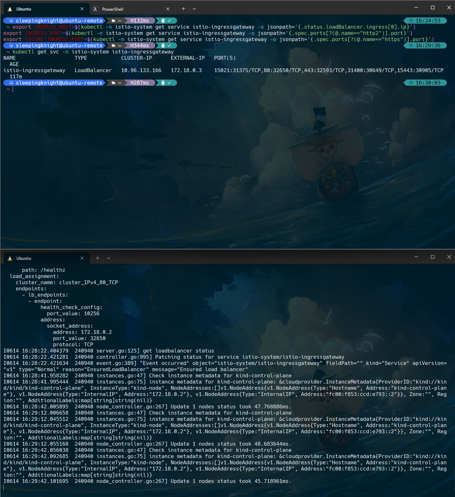
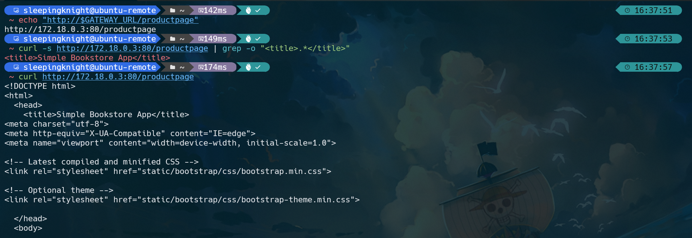
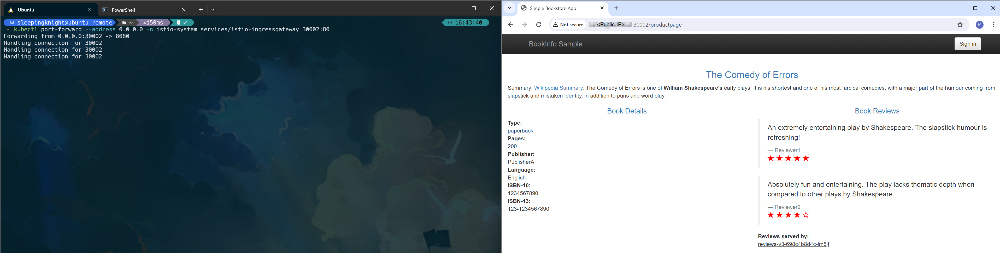
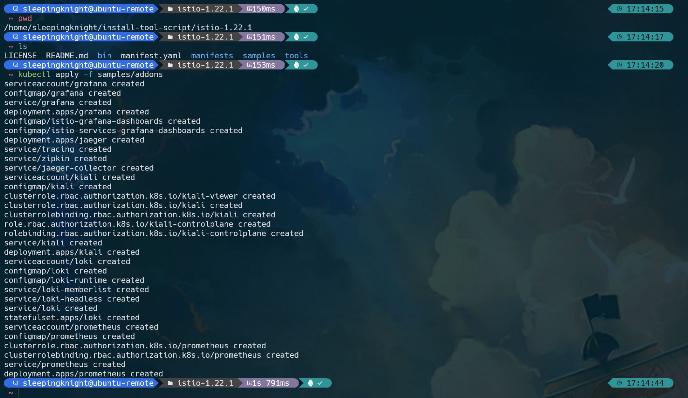
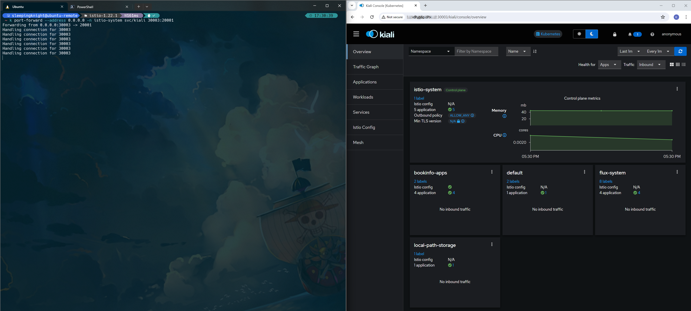

# Part 0: Pre-Req for Load Balancer Service Istio in KIND Cluster

**Step 1:** Make sure you already have Golang installed on your machine. If you don't have it, please follow this [Go](https://go.dev/doc/install) installation guideline

**Step 2:** You can install [cloud-provider-kind](https://github.com/kubernetes-sigs/cloud-provider-kind) using go install:
```shell
go install sigs.k8s.io/cloud-provider-kind@latest
```

**Step 3:** This will install the binary in $GOBIN (typically ~/go/bin); you can make it available elsewhere if appropriate:
```
sudo install ~/go/bin/cloud-provider-kind /usr/local/bin
```

**Step 4:** Once your KIND Cluster is ready, you need to remove the special label **node.kubernetes.io/exclude-from-external-load-balancers** on the **control-plane nodes** to be able to access the workloads running on those nodes using a LoadBalancer Service.
```shell
kubectl label node kind-control-plane node.kubernetes.io/exclude-from-external-load-balancers-

# Expected Output
# label "node.kubernetes.io/exclude-from-external-load-balancers" not found.
# node/kind-control-plane not labeled

# OR
# node/kind-control-plane unlabeled
```

**Step 5:** Once the cluster is running, we need to run the **cloud-provider-kind** in a terminal and keep it running. The **cloud-provider-kind** will monitor all your KIND clusters and **Services** with Type **LoadBalancer** and create the corresponding LoadBalancer containers that will expose those Services. (Keep the terminal open)
```shell
cloud-provider-kind
```


# Part 1: Istio installation

**Step 1:** Visit the [Istio release](https://github.com/istio/istio/releases/) page to download the installation files according to the OS you are using. If you are using Linux or macOS, run the following command to download (latest version) and extract it automatically.

```shell
curl -L https://istio.io/downloadIstio | sh -


# Downloading istio-1.22.1 from https://github.com/istio/istio/releases/download/1.22.1/istio-1.22.1-linux-amd64.tar.gz ...

# Istio 1.22.1 Download Complete!

# Istio has been successfully downloaded into the istio-1.22.1 folder on your system.

# Next Steps:
# See https://istio.io/latest/docs/setup/install/ to add Istio to your Kubernetes cluster.

# To configure the istioctl client tool for your workstation,
# add the /home/sleepingknight/istio-1.22.1/bin directory to your environment path variable with:
#          export PATH="$PATH:/home/sleepingknight/istio-1.22.1/bin"

# Begin the Istio pre-installation check by running:
#          istioctl x precheck

# Need more information? Visit https://istio.io/latest/docs/setup/install/
```

**Step 2:** For Linux or macOS users, add **istioctl** (command line tool for managing deployments on Istio service mesh) to your user executable file.

```shell
sudo mv istio-1.22.1/bin/istioctl /usr/bin/istioctl
```

**Step 3:** OK, it's time for us to install Istio. In the process of installing Istio, we will use a **demo** type profile to make it suitable for testing scenarios because it presents Istio functionality with simple resources.

```shell
istioctl install --set profile=demo -y


# ✔ Istio core installed
# ✔ Istiod installed
# ✔ Egress gateways installed
# ✔ Ingress gateways installed
# ✔ Installation complete                                                                                                                        
# Made this installation the default for injection and validation.
```

**Step 4:** Verify istio components by running this command

```shell
kubectl get all -n istio-system


# NAME                                        READY   STATUS    RESTARTS   AGE
# pod/istio-egressgateway-7cfd5c8676-xrndl    1/1     Running   0          96s
# pod/istio-ingressgateway-86f46c495b-smftw   1/1     Running   0          96s
# pod/istiod-f68799b78-7pqmq                  1/1     Running   0          110s

# NAME                           TYPE           CLUSTER-IP      EXTERNAL-IP   PORT(S)                                                                      AGE
# service/istio-egressgateway    ClusterIP      10.96.244.236   <none>        80/TCP,443/TCP                                                               96s
# service/istio-ingressgateway   LoadBalancer   10.96.133.166   <pending>     15021:31375/TCP,80:32650/TCP,443:32593/TCP,31400:30649/TCP,15443:30905/TCP   96s
# service/istiod                 ClusterIP      10.96.243.10    <none>        15010/TCP,15012/TCP,443/TCP,15014/TCP                                        110s

# NAME                                   READY   UP-TO-DATE   AVAILABLE   AGE
# deployment.apps/istio-egressgateway    1/1     1            1           96s
# deployment.apps/istio-ingressgateway   1/1     1            1           96s
# deployment.apps/istiod                 1/1     1            1           110s

# NAME                                              DESIRED   CURRENT   READY   AGE
# replicaset.apps/istio-egressgateway-7cfd5c8676    1         1         1       96s
# replicaset.apps/istio-ingressgateway-86f46c495b   1         1         1       96s
# replicaset.apps/istiod-f68799b78                  1         1         1       110s
```

**Step 5:** After that, create a new namespace called **bookinfo-apps** then add a label to that namespace to instruct Istio to automatically *inject* (include) the Envoy sidecar proxy when you deploy the application later.

```shell
kubectl create namespace bookinfo-apps && kubectl label namespace bookinfo-apps istio-injection=enabled


# namespace/bookinfo-apps created
# namespace/bookinfo-apps labeled
```

**Step 6:** You can also verify the namespace label, by running this command
```shell
kubectl get namespace --show-labels


# NAME                 STATUS   AGE    LABELS
# bookinfo-apps        Active   37s    istio-injection=enabled,kubernetes.io/metadata.name=bookinfo-apps
# default              Active   16d    kubernetes.io/metadata.name=default
# istio-system         Active   7m7s   kubernetes.io/metadata.name=istio-system
# kube-node-lease      Active   16d    kubernetes.io/metadata.name=kube-node-lease
# kube-public          Active   16d    kubernetes.io/metadata.name=kube-public
# kube-system          Active   16d    kubernetes.io/metadata.name=kube-system
# local-path-storage   Active   16d    kubernetes.io/metadata.name=local-path-storage
```


# Part 2: Deploy the Bookinfo Application

**Step 1:** Run the following command to copy the lines of code below to the **bookinfo.yaml** file.
```shell
cat <<EOF > bookinfo.yaml
# Details service
apiVersion: v1
kind: Service
metadata:
  name: details
  labels:
    app: details
    service: details
spec:
  ports:
  - port: 9080
    name: http
  selector:
    app: details
---
apiVersion: v1
kind: ServiceAccount
metadata:
  name: bookinfo-details
  labels:
    account: details
---
apiVersion: apps/v1
kind: Deployment
metadata:
  name: details-v1
  labels:
    app: details
    version: v1
spec:
  replicas: 1
  selector:
    matchLabels:
      app: details
      version: v1
  template:
    metadata:
      labels:
        app: details
        version: v1
    spec:
      serviceAccountName: bookinfo-details
      containers:
      - name: details
        image: docker.io/istio/examples-bookinfo-details-v1:1.17.0
        imagePullPolicy: IfNotPresent
        ports:
        - containerPort: 9080
        securityContext:
          runAsUser: 1000
---
# Ratings service
apiVersion: v1
kind: Service
metadata:
  name: ratings
  labels:
    app: ratings
    service: ratings
spec:
  ports:
  - port: 9080
    name: http
  selector:
    app: ratings
---
apiVersion: v1
kind: ServiceAccount
metadata:
  name: bookinfo-ratings
  labels:
    account: ratings
---
apiVersion: apps/v1
kind: Deployment
metadata:
  name: ratings-v1
  labels:
    app: ratings
    version: v1
spec:
  replicas: 1
  selector:
    matchLabels:
      app: ratings
      version: v1
  template:
    metadata:
      labels:
        app: ratings
        version: v1
    spec:
      serviceAccountName: bookinfo-ratings
      containers:
      - name: ratings
        image: docker.io/istio/examples-bookinfo-ratings-v1:1.17.0
        imagePullPolicy: IfNotPresent
        ports:
        - containerPort: 9080
        securityContext:
          runAsUser: 1000
---
# Reviews service
apiVersion: v1
kind: Service
metadata:
  name: reviews
  labels:
    app: reviews
    service: reviews
spec:
  ports:
  - port: 9080
    name: http
  selector:
    app: reviews
---
apiVersion: v1
kind: ServiceAccount
metadata:
  name: bookinfo-reviews
  labels:
    account: reviews
---
apiVersion: apps/v1
kind: Deployment
metadata:
  name: reviews-v1
  labels:
    app: reviews
    version: v1
spec:
  replicas: 1
  selector:
    matchLabels:
      app: reviews
      version: v1
  template:
    metadata:
      labels:
        app: reviews
        version: v1
    spec:
      serviceAccountName: bookinfo-reviews
      containers:
      - name: reviews
        image: docker.io/istio/examples-bookinfo-reviews-v1:1.17.0
        imagePullPolicy: IfNotPresent
        env:
        - name: LOG_DIR
          value: "/tmp/logs"
        ports:
        - containerPort: 9080
        volumeMounts:
        - name: tmp
          mountPath: /tmp
        - name: wlp-output
          mountPath: /opt/ibm/wlp/output
        securityContext:
          runAsUser: 1000
      volumes:
      - name: wlp-output
        emptyDir: {}
      - name: tmp
        emptyDir: {}
---
apiVersion: apps/v1
kind: Deployment
metadata:
  name: reviews-v2
  labels:
    app: reviews
    version: v2
spec:
  replicas: 1
  selector:
    matchLabels:
      app: reviews
      version: v2
  template:
    metadata:
      labels:
        app: reviews
        version: v2
    spec:
      serviceAccountName: bookinfo-reviews
      containers:
      - name: reviews
        image: docker.io/istio/examples-bookinfo-reviews-v2:1.17.0
        imagePullPolicy: IfNotPresent
        env:
        - name: LOG_DIR
          value: "/tmp/logs"
        ports:
        - containerPort: 9080
        volumeMounts:
        - name: tmp
          mountPath: /tmp
        - name: wlp-output
          mountPath: /opt/ibm/wlp/output
        securityContext:
          runAsUser: 1000
      volumes:
      - name: wlp-output
        emptyDir: {}
      - name: tmp
        emptyDir: {}
---
apiVersion: apps/v1
kind: Deployment
metadata:
  name: reviews-v3
  labels:
    app: reviews
    version: v3
spec:
  replicas: 1
  selector:
    matchLabels:
      app: reviews
      version: v3
  template:
    metadata:
      labels:
        app: reviews
        version: v3
    spec:
      serviceAccountName: bookinfo-reviews
      containers:
      - name: reviews
        image: docker.io/istio/examples-bookinfo-reviews-v3:1.17.0
        imagePullPolicy: IfNotPresent
        env:
        - name: LOG_DIR
          value: "/tmp/logs"
        ports:
        - containerPort: 9080
        volumeMounts:
        - name: tmp
          mountPath: /tmp
        - name: wlp-output
          mountPath: /opt/ibm/wlp/output
        securityContext:
          runAsUser: 1000
      volumes:
      - name: wlp-output
        emptyDir: {}
      - name: tmp
        emptyDir: {}
---
# Productpage services
apiVersion: v1
kind: Service
metadata:
  name: productpage
  labels:
    app: productpage
    service: productpage
spec:
  ports:
  - port: 9080
    name: http
  selector:
    app: productpage
---
apiVersion: v1
kind: ServiceAccount
metadata:
  name: bookinfo-productpage
  labels:
    account: productpage
---
apiVersion: apps/v1
kind: Deployment
metadata:
  name: productpage-v1
  labels:
    app: productpage
    version: v1
spec:
  replicas: 1
  selector:
    matchLabels:
      app: productpage
      version: v1
  template:
    metadata:
      labels:
        app: productpage
        version: v1
    spec:
      serviceAccountName: bookinfo-productpage
      containers:
      - name: productpage
        image: docker.io/istio/examples-bookinfo-productpage-v1:1.17.0
        imagePullPolicy: IfNotPresent
        ports:
        - containerPort: 9080
        volumeMounts:
        - name: tmp
          mountPath: /tmp
        securityContext:
          runAsUser: 1000
      volumes:
      - name: tmp
        emptyDir: {}
---
EOF
```

The manifest file above contains definitions of Kubernetes service, Kubernetes service account, and Kubernetes deployment for the 4 services we discussed at the beginning, namely details, ratings, reviews (has three versions), and productpage. Please pay attention to as much detail as possible.

**Step 2:** Next, deploy the Kubernetes manifest.
```shell
kubectl apply -f bookinfo.yaml -n bookinfo-apps


# service/details created
# serviceaccount/bookinfo-details created
# deployment.apps/details-v1 created
# service/ratings created
# serviceaccount/bookinfo-ratings created
# deployment.apps/ratings-v1 created
# service/reviews created
# serviceaccount/bookinfo-reviews created
# deployment.apps/reviews-v1 created
# deployment.apps/reviews-v2 created
# deployment.apps/reviews-v3 created
# service/productpage created
# serviceaccount/bookinfo-productpage created
# deployment.apps/productpage-v1 created
```

**Step 3:** The Bookinfo application will start running. Take a look at the Kubernetes service for Bookinfo.
```shell
kubectl get svc -n bookinfo-apps


# NAME          TYPE        CLUSTER-IP      EXTERNAL-IP   PORT(S)    AGE
# details       ClusterIP   10.96.80.106    <none>        9080/TCP   78s
# productpage   ClusterIP   10.96.148.182   <none>        9080/TCP   78s
# ratings       ClusterIP   10.96.53.232    <none>        9080/TCP   78s
# reviews       ClusterIP   10.96.116.184   <none>        9080/TCP   78s
```

**Step 4:** See also Kubernetes pod for Bookinfo.
```shell
kubectl get pods -n bookinfo-apps


# NAME                             READY   STATUS    RESTARTS   AGE
# details-v1-6c98bc7c4c-ms9ws      2/2     Running   0          2m56s
# productpage-v1-d5d6d8b8c-gdzzr   2/2     Running   0          2m55s
# ratings-v1-7645575cf9-5sb78      2/2     Running   0          2m56s
# reviews-v1-6c5c97576c-6lztq      2/2     Running   0          2m56s
# reviews-v2-575d87db6c-szjjs      2/2     Running   0          2m56s
# reviews-v3-698c4b8d4c-lm5jf      2/2     Running   0          2m55s
```

Make sure the pod status is Running before continuing to the next stage.

**Step 5:** Verify that everything is working normally. Please run the following command to see if the application is running properly and serving the proper HTML page by checking the page title in the HTTP response.
```shell
kubectl exec "$(kubectl get pod -n bookinfo-apps -l app=ratings -o jsonpath='{.items[0].metadata.name}')" -n bookinfo-apps -c ratings -- curl -sS productpage:9080/productpage | grep -o "<title>.*</title>"


# <title>Simple Bookstore App</title>
```




# Part 3: Installing Istio Ingress Gateway

Now it's time for us to interact with Istio to manage application traffic. First, we will install Istio Ingress Gateway. You can use Istio Ingress Gateway to manage traffic entering the service mesh by determining what is permitted and denied. 

Unlike other mechanisms that also control incoming traffic (for example, the Kubernetes Ingress API), Istio Ingress Gateway allows you to use the full functionality and flexibility of Istio traffic routing. This is because Istio Ingress Gateway allows you to configure layers 4-6 load balancing to expose ports, TLS settings, and so on. Let's go!

**Step 1:** OK, we have successfully deployed the Bookinfo application. Unfortunately, this application cannot be accessed from outside. For this, we need to create an [Istio Ingress Gateway](https://istio.io/latest/docs/concepts/traffic-management/#gateways) which functions to manage network traffic entering your service mesh architecture (see again the Bookinfo application architecture diagram above). Please run the following command to copy the below lines of code to the **bookinfo-gateway.yaml** file.

```shell
cat <<EOF > bookinfo-gateway.yaml
apiVersion: networking.istio.io/v1alpha3
kind: Gateway
metadata:
  name: bookinfo-gateway
spec:
  selector:
    istio: ingressgateway # use istio default controller
  servers:
  - port:
      number: 80
      name: http
      protocol: HTTP
    hosts:
    - "*"
---
apiVersion: networking.istio.io/v1alpha3
kind: VirtualService
metadata:
  name: bookinfo
spec:
  hosts:
  - "*"
  gateways:
  - bookinfo-gateway
  http:
  - match:
    - uri:
        exact: /productpage
    - uri:
        prefix: /static
    - uri:
        exact: /login
    - uri:
        exact: /logout
    - uri:
        prefix: /api/v1/products
    route:
    - destination:
        host: productpage
        port:
          number: 9080
EOF
```

**Step 2:** Just deploy the Kubernetes manifest file.
```shell
kubectl apply -f bookinfo-gateway.yaml -n bookinfo-apps


# gateway.networking.istio.io/bookinfo-gateway created
# virtualservice.networking.istio.io/bookinfo created
```

**Step 3:** Make sure there are no issues with the Istio configuration.
```shell
istioctl analyze


# ✔ No validation issues found when analyzing namespace: default.
```



**Step 4:** The next step is that we need to know the IP address and port of the Istio Ingress Gateway, then save these values ​​to environment variables to make it easier to access the application.

**Step 5:** OK, please open a **new terminal window** (or a new WSL/Ubuntu window) and run the following command in the new terminal window.
```shell
# KIND (In this tutorial, I'm using KIND Cluster)
cloud-provider-kind

# OR

# Minikube
minikube tunnel
```

This command starts the KIND tunnel process which will send traffic to your Istio Ingress Gateway. This process will give us an external load balancer (EXTERNAL-IP) for the Kubernetes service named `istio-ingressgateway` in the **istio-system** namespace.

**Step 6:** Then, we save the necessary values ​​into the environment variables in the previous terminal window (while the Minikube tunnel process continues to run in the new terminal window).
```shell
export INGRESS_HOST=$(kubectl -n istio-system get service istio-ingressgateway -o jsonpath='{.status.loadBalancer.ingress[0].ip}')
export INGRESS_PORT=$(kubectl -n istio-system get service istio-ingressgateway -o jsonpath='{.spec.ports[?(@.name=="http2")].port}')
export SECURE_INGRESS_PORT=$(kubectl -n istio-system get service istio-ingressgateway -o jsonpath='{.spec.ports[?(@.name=="https")].port}')
```

**Step 7:** If you are confused, here is the process.



**Step 8:** If all good, make sure the IP address and port for the Istio Ingress Gateway are successfully saved to each environment variable.
```shell
echo "$INGRESS_HOST" "$INGRESS_PORT" "$SECURE_INGRESS_PORT"


# 172.18.0.3 80 443
```

**Step 9:** Next, determine the value for the environment variable named **GATEWAY_URL** from the previous Istio Ingress Gateway IP address and port values.
```shell
export GATEWAY_URL=$INGRESS_HOST:$INGRESS_PORT
```

**Step 10:** Check whether the IP address and port values ​​for the Istio Ingress Gateway are correctly stored in **GATEWAY_URL**.
```shell
echo "$GATEWAY_URL"


# 172.18.0.3:80
```

**Step 11:** Let's check whether the Bookinfo application can be accessed from outside the cluster. At first, follow these commands to get the external address of the Bookinfo app.
```shell
echo "http://$GATEWAY_URL/productpage"


# http://172.18.0.3:80/productpage
```

**Step 12:** Then, access the address wether using curl command or via a web browser. Make sure the product page of the Bookinfo application appears.
- Curl Command


- Web Browser


Top! The Bookinfo application has been successfully deployed and can be accessed from outside the cluster (our computer) thanks to the help of Istio Ingress Gateway. Next, we will try to access the dashboard so we can analyze the service mesh.


# Part 4: Accessing the Dashboard

Istio is integrated with a number of telemetry collection tools so it can help you gain insight into the service mesh structure, display service mesh topology, and analyze service mesh conditions. 

So, this time we will deploy the [Kiali](https://kiali.io/) dashboard along with a number of other addons such as [Prometheus](https://prometheus.io/), [Grafana](https://grafana.com/), and [Jaeger](https://www.jaegertracing.io/). Let's start.

**Step 1:** Install all addons in the samples/addons directory. Wait until everything is finished creating.



**Step 2:** Next, make sure the rollout status for Kiali is successful.
```shell
kubectl rollout status deployment/kiali -n istio-system


# deployment "kiali" successfully rolled out
```

**Step 3:** You can also check the addones components which already deployed, by running this command
```shell
kubectl get all -n istio-system


# NAME                                        READY   STATUS    RESTARTS   AGE
# pod/grafana-657df88ffd-5wpbm                1/1     Running   0          11m
# pod/istio-egressgateway-7cfd5c8676-xrndl    1/1     Running   0          174m
# pod/istio-ingressgateway-86f46c495b-smftw   1/1     Running   0          174m
# pod/istiod-f68799b78-7pqmq                  1/1     Running   0          174m
# pod/jaeger-697d898d6-rr727                  1/1     Running   0          11m
# pod/kiali-5899548ff7-7jnfq                  1/1     Running   0          11m
# pod/loki-0                                  1/1     Running   0          11m
# pod/prometheus-777db476b6-855g9             2/2     Running   0          11m

# NAME                           TYPE           CLUSTER-IP      EXTERNAL-IP   PORT(S)                                                                      AGE
# service/grafana                ClusterIP      10.96.39.40     <none>        3000/TCP                                                                     11m
# service/istio-egressgateway    ClusterIP      10.96.244.236   <none>        80/TCP,443/TCP                                                               174m
# service/istio-ingressgateway   LoadBalancer   10.96.133.166   172.18.0.3    15021:31375/TCP,80:32650/TCP,443:32593/TCP,31400:30649/TCP,15443:30905/TCP   174m
# service/istiod                 ClusterIP      10.96.243.10    <none>        15010/TCP,15012/TCP,443/TCP,15014/TCP                                        174m
# service/jaeger-collector       ClusterIP      10.96.8.161     <none>        14268/TCP,14250/TCP,9411/TCP,4317/TCP,4318/TCP                               11m
# service/kiali                  ClusterIP      10.96.62.14     <none>        20001/TCP,9090/TCP                                                           11m
# service/loki                   ClusterIP      10.96.58.70     <none>        3100/TCP,9095/TCP                                                            11m
# service/loki-headless          ClusterIP      None            <none>        3100/TCP                                                                     11m
# service/loki-memberlist        ClusterIP      None            <none>        7946/TCP                                                                     11m
# service/prometheus             ClusterIP      10.96.114.253   <none>        9090/TCP                                                                     11m
# service/tracing                ClusterIP      10.96.168.157   <none>        80/TCP,16685/TCP                                                             11m
# service/zipkin                 ClusterIP      10.96.115.139   <none>        9411/TCP                                                                     11m

# NAME                                   READY   UP-TO-DATE   AVAILABLE   AGE
# deployment.apps/grafana                1/1     1            1           11m
# deployment.apps/istio-egressgateway    1/1     1            1           174m
# deployment.apps/istio-ingressgateway   1/1     1            1           174m
# deployment.apps/istiod                 1/1     1            1           174m
# deployment.apps/jaeger                 1/1     1            1           11m
# deployment.apps/kiali                  1/1     1            1           11m
# deployment.apps/prometheus             1/1     1            1           11m

# NAME                                              DESIRED   CURRENT   READY   AGE
# replicaset.apps/grafana-657df88ffd                1         1         1       11m
# replicaset.apps/istio-egressgateway-7cfd5c8676    1         1         1       174m
# replicaset.apps/istio-ingressgateway-86f46c495b   1         1         1       174m
# replicaset.apps/istiod-f68799b78                  1         1         1       174m
# replicaset.apps/jaeger-697d898d6                  1         1         1       11m
# replicaset.apps/kiali-5899548ff7                  1         1         1       11m
# replicaset.apps/prometheus-777db476b6             1         1         1       11m

# NAME                    READY   AGE
# statefulset.apps/loki   1/1     11m
```

**Step 4:** Let's just access the Kiali dashboard with this command.
```shell
istioctl dashboard kiali


# http://localhost:20001/kiali
```

**Step 5:** A new browser tab will open displaying the Kiali dashboard. If it doesn't open automatically, please access the URL that appears manually in your browser.

However, I will use port forward, because I will access Kiali Dashboard though Public IP



**Step 6:** In the left navigation menu, select **Traffic Graph**. Click the **Select Namespaces** drop down, then check **bookinfo-apps**.

**Step 7:** To make the trace data visualization process easier, change the Traffic metrics per refresh to Last 1h and Refresh interval to Every 10s.

